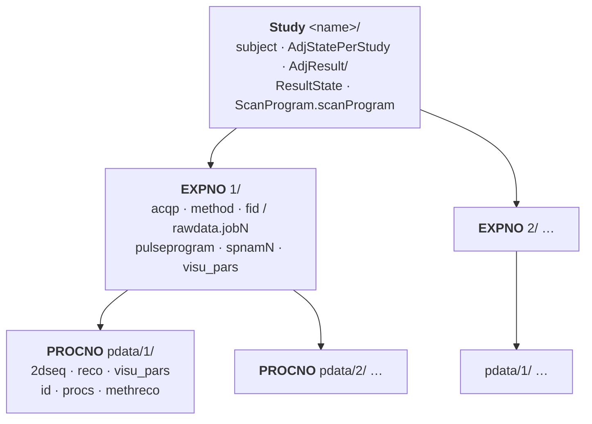
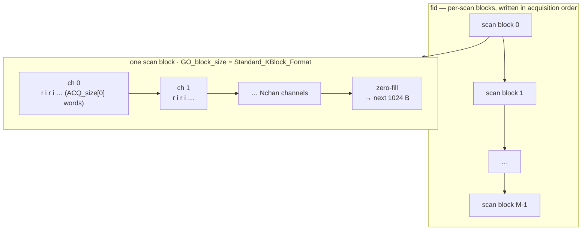
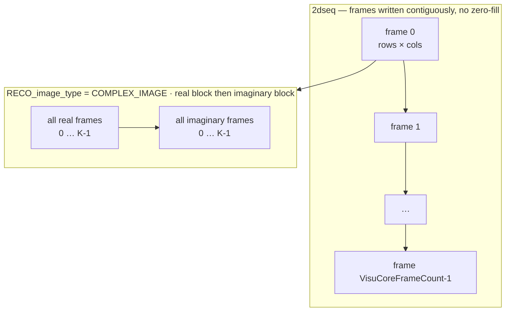
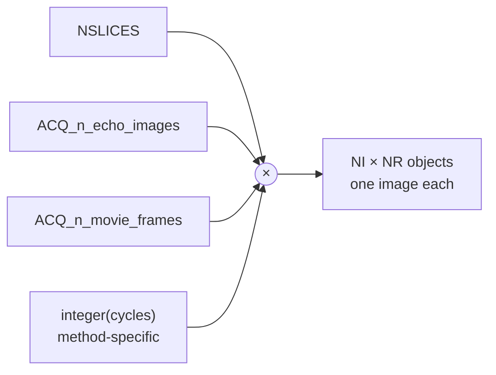
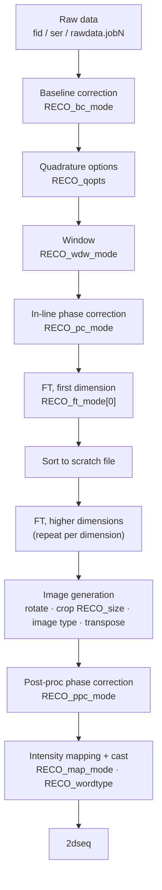
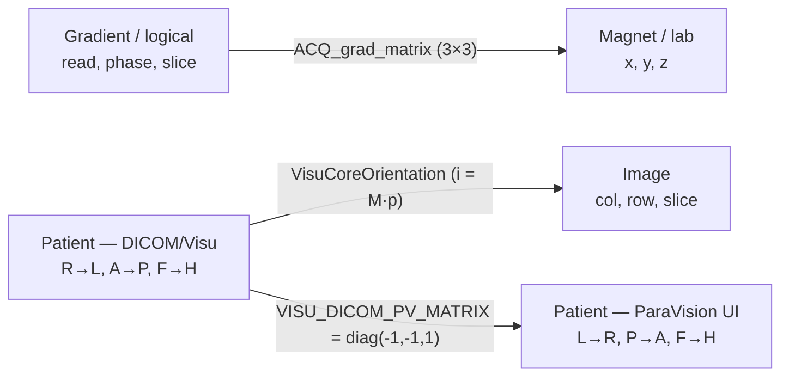

# Bruker ParaVision Raw Data Format

Complete documentation of the Bruker preclinical MRI raw data format as used by ParaVision 5.x and 6.x.

This is a generic specification of the format, independent of any particular dataset. It is
derived from the official Bruker documentation — the File Formats manual (`D01_FileFormats.pdf`
for PV6, `D12_FileFormats.pdf` for PV5.1), the Parameter Reference (`D02_PvParams.pdf` /
`D13_PvParams.pdf`), the Image Reconstruction manual (`D07_ImageReco.pdf`), and the
XWIN-NMR/TopSpin `fileform.pdf` — and the enum names and values are taken verbatim from the
ParaVision C headers that define them (`recotyp.h`, `acqutyp.h`, `d3typ.h`, `Visu/VisuTypes.h`,
`Visu/VisuDefines.h`, `Reco/RecoStageTyp.h`, and the `PvmTypes/*.h` toolbox headers). Where the
file-format manual and the on-disk parameter file disagree on spelling (e.g. the manual's
`RECO_word_type` vs the stored `RECO_wordtype`), both forms are noted.

The core format (directory layout, JCAMP-DX parameter files, `fid`/`2dseq` binary layouts)
follows the Bruker manuals and headers. The sequence-specific auxiliary files that the
manuals do not cover (e.g. `traj`, navigator and spiral data) are described from the
corresponding ParaVision toolbox headers (`PvmTypes/TrajectoryTypes.h`, `SpiralTypes.h`,
`epiTypes.h`). The ParaVision 360 specifics are cross-referenced against the Bruker-supplied
standard dataset published at
[cecilyen/PV360_StdData](https://github.com/cecilyen/PV360_StdData).

## Table of Contents

- [1. Dataset Directory Structure](#1-dataset-directory-structure)
  - [1.1 Study Level](#11-study-level)
  - [1.2 Experiment Level (EXPNO)](#12-experiment-level-expno)
  - [1.3 Reconstruction Level (PROCNO)](#13-reconstruction-level-procno)
- [2. Parameter File Format (JCAMP-DX)](#2-parameter-file-format-jcamp-dx)
  - [2.1 Basic Format](#21-basic-format)
  - [2.2 Data Types](#22-data-types)
  - [2.3 Array and Struct Encoding](#23-array-and-struct-encoding)
  - [2.4 Parameter Visibility and Editing](#24-parameter-visibility-and-editing)
- [3. Binary Data Files](#3-binary-data-files)
  - [3.1 fid - Raw Acquisition Data (Single Experiment)](#31-fid---raw-acquisition-data-single-experiment)
  - [3.2 ser - Serial Raw Data (Multiple Experiments)](#32-ser---serial-raw-data-multiple-experiments)
  - [3.3 rawdata.job\[N\] - Job-Based Raw Data (PV6+)](#33-rawdatajobn---job-based-raw-data-pv6)
  - [3.4 2dseq - Reconstructed Image Data](#34-2dseq---reconstructed-image-data)
  - [3.5 Method-Specific Auxiliary Files](#35-method-specific-auxiliary-files)
- [4. Parameter Files by Location](#4-parameter-files-by-location)
  - [4.1 Study-Level Parameter Files](#41-study-level-parameter-files)
  - [4.2 Experiment-Level Parameter Files](#42-experiment-level-parameter-files)
  - [4.3 Reconstruction-Level Parameter Files](#43-reconstruction-level-parameter-files)
- [5. ACQP Parameters (Acquisition)](#5-acqp-parameters-acquisition)
  - [5.1 Basic Dimensions](#51-basic-dimensions)
  - [5.2 Scan Loop Structure](#52-scan-loop-structure)
  - [5.3 Data Encoding](#53-data-encoding)
  - [5.4 Geometry and Orientation](#54-geometry-and-orientation)
  - [5.5 Phase Encoding](#55-phase-encoding)
  - [5.6 Patient Position](#56-patient-position)
- [6. RECO Parameters (Reconstruction)](#6-reco-parameters-reconstruction)
  - [6.1 Processing Mode](#61-processing-mode)
  - [6.2 Input Reordering](#62-input-reordering)
  - [6.3 FT Sizes and Output Sizes](#63-ft-sizes-and-output-sizes)
  - [6.4 Baseline Correction](#64-baseline-correction)
  - [6.5 Quadrature Options](#65-quadrature-options)
  - [6.6 Window Functions](#66-window-functions)
  - [6.7 Fourier Transform Mode](#67-fourier-transform-mode)
  - [6.8 Phase Correction](#68-phase-correction)
  - [6.9 Image Type and Transposition](#69-image-type-and-transposition)
  - [6.10 Output Word Type and Mapping](#610-output-word-type-and-mapping)
  - [6.11 Output Parameters (Read-Only)](#611-output-parameters-read-only)
- [7. VISU Parameters (Visualization)](#7-visu-parameters-visualization)
  - [7.1 Dataset Administration (VisuInstance)](#71-dataset-administration-visuinstance)
  - [7.2 Core Image Description (VisuCore)](#72-core-image-description-visucore)
  - [7.3 Data Storage (VisuPixel)](#73-data-storage-visupixel)
  - [7.4 Frame Groups (VisuFrameOrderDesc)](#74-frame-groups-visuframeorderdesc)
  - [7.5 Subject Parameters (VisuSubject)](#75-subject-parameters-visusubject)
  - [7.6 Study Parameters (VisuStudy)](#76-study-parameters-visustudy)
  - [7.7 Series Parameters (VisuSeries)](#77-series-parameters-visuseries)
  - [7.8 Equipment Parameters (VisuEquipment)](#78-equipment-parameters-visuequipment)
  - [7.9 Acquisition Parameters (VisuAcquisition)](#79-acquisition-parameters-visuacquisition)
  - [7.10 Slice Packages](#710-slice-packages)
- [8. D3/d3proc Parameters (Legacy Image Display)](#8-d3d3proc-parameters-legacy-image-display)
- [9. Subject File](#9-subject-file)
- [10. Image Reconstruction Pipeline](#10-image-reconstruction-pipeline)
  - [10.1 Standard Reconstruction](#101-standard-reconstruction)
  - [10.2 Multi-Channel Reconstruction](#102-multi-channel-reconstruction)
  - [10.3 DC Spike Elimination](#103-dc-spike-elimination)
  - [10.4 Image Mapping](#104-image-mapping)
- [11. GO Parameters (Acquisition/Reconstruction Control)](#11-go-parameters-acquisitionreconstruction-control)
- [12. Coordinate Systems](#12-coordinate-systems)
- [13. Version Differences (PV5 vs PV6 vs PV360)](#13-version-differences-pv5-vs-pv6-vs-pv360)
- [14. Worked Examples (Size Calculations)](#14-worked-examples-size-calculations)

---

## 1. Dataset Directory Structure

A Bruker PvDataset is organized as a three-level hierarchy: study, experiment, and reconstruction.



The three levels are the **Study** (`<name>/`, one per session), the **experiment**
(`<EXPNO>/`, one acquisition each), and the **reconstruction** (`pdata/<PROCNO>/`, one derived
image series each). The full path to a reconstruction is
`<DataPath>/<name>/<expno>/pdata/<procno>`.

### 1.1 Study Level

```
<StudyDir>/
    subject                    # Subject/patient and study parameters (SUBJECT group)
    AdjStatePerStudy           # Info about the last per-study adjustments (AdjStatePerStudy group)
    AdjResult/                 # One subdir per adjustment result, each holding result.jcamp (PV5 and PV6)
    ResultState                # References to adjustment results (AdjResult group) [PV6]
    ScanProgram.scanProgram    # Scan-program info from the database (XML) [PV6]
    1/                         # First experiment (EXPNO=1)
    2/                         # Second experiment (EXPNO=2)
    ...
```

The study directory name is created by ParaVision. Its maximum length is **64 characters in
PV6** (`<DataPath>/<name>/<expno>/pdata/<procno>`) and **15 characters in PV5**
(`<DiskUnit>/data/<user>/<type>/<name>/<expno>/pdata/<procno>`, where `<type>` is `nmr`).
The name is typically `<SubjectName>_<SubjectId>_<StudyNum>_<Date>` or similar, though
naming conventions vary.

### 1.2 Experiment Level (EXPNO)

Each experiment directory (numbered starting from 1) contains the acquisition data and parameters:

```
<EXPNO>/
    acqp                   # Acquisition parameters (ACQP group)
    method                 # Method-specific parameters (MethodClass)
    fid                    # Raw acquisition data (binary) - non-job-based acquisition
    rawdata.job0           # Job-based raw data (binary) [PV6+]
    rawdata.job1           # Additional raw data jobs [PV6+]
    pulseprogram           # Pulse program source code (created when acquisition completes)
    spnamN                 # Shape pulse definitions used during acquisition (N = 0,1,2,...)
    configscan             # Scan-specific configuration, e.g. coil and operation mode (CONFIG_SCAN)
    AdjStatePerScan        # Info about the last per-scan adjustments (AdjStatePerScan group)
    AdjRefgProfiles.dat    # Adjustment reference profiles (binary, when reference scans run)
    uxnmr.info             # Acquisition info (XWIN-NMR/TopSpin compatibility)
    uxnmr.par              # Acquisition parameters (XWIN-NMR/TopSpin compatibility)
    specpar                # Spectrometer parameters
    visu_pars              # (Experiment-level) Visu parameters
    traj                   # k-space trajectory (binary, float64) - non-Cartesian methods (UTE/ZTE/Spiral)
    pdata/                 # Processing data directory
        1/                 # First reconstruction (PROCNO=1)
        2/                 # Second reconstruction (optional)
        ...
```

> **Method-specific companion files:** In addition to `fid`, certain acquisition methods write
> binary companion files alongside it (e.g. `fid.spiral`, `fid.navFid`, `fid.orig`) or a
> `traj` trajectory file. PV6 job-based acquisitions may write `rawdata.jobN` and a
> `rawdata.<subtype>` (e.g. `rawdata.Navigator`). These are described in
> [Section 3.5](#35-method-specific-auxiliary-files).

> **Note on `fid` vs `ser`:** In native ParaVision the raw data is always written to `fid`
> (one binary stream per experiment). The file is only **renamed to `ser` when the experiment
> is exported to TopSpin** (see `manuals/.../D01_FileFormats.pdf`). The TopSpin `ser` format
> stores the experiment as `TD(F1)` individual 1D fids, each aligned to a 1024-byte block
> boundary (256 32-bit points); see [Section 3.2](#32-ser---serial-raw-data-multiple-experiments).

### 1.3 Reconstruction Level (PROCNO)

Each reconstruction directory contains the processed image data:

```
<PROCNO>/
    2dseq                  # Reconstructed image data (binary)
    visu_pars              # Visualization parameters (Visu group)
    reco                   # Reconstruction input/output parameters (RECO group)
    methreco               # Method-specific reconstruction input (MethodRecoGroup) [PV6, some reconstructions only]
    id                     # Unique dataset identification (DATASET_ID)
    procs                  # Extra processing parameters (PROC group, for TopSpin)
    d3proc                 # Legacy image display parameters (D3 group) [PV5: every PROCNO; PV6: legacy/derived PROCNOs only]
    meta                   # ParaVision/TopSpin marker via MAGIC NUMBER [PV5, legacy]
    roi                    # Region-of-interest definitions (ROI group)
    isa                    # Image Sequence Analysis tool status (ISA group)
    fun/                   # Functional imaging tool files (directory)
```

> **PV5 vs PV6:** In ParaVision 5.x every PROCNO carries a `d3proc` (and a `meta`), as the D3
> class predates the Visu parameters that supersede it. PV6 drops `meta` and no longer writes
> `d3proc` for primary reconstructions, but it **still writes `d3proc` for legacy/derived
> reconstructions** (e.g. secondary `pdata/2` ISA maps — the PV6 File Formats manual lists it as
> "exists only for legacy datasets"). PV6 may instead add `methreco`, but only for reconstructions
> that have method-specific reco input — many PROCNOs have no `methreco`. The
> `2dseq`/`reco`/`visu_pars` triple is the minimal, always-present set.

---

## 2. Parameter File Format (JCAMP-DX)

All parameter files (`acqp`, `method`, `reco`, `visu_pars`, `d3proc`, `subject`, etc.) use the JCAMP-DX format, an ASCII-based labelled data interchange standard originally designed for spectroscopic data.

### 2.1 Basic Format

Each file begins with a header and ends with a terminator:

```
##TITLE=Parameter List, ParaVision 6.0.1
##JCAMPDX=4.24
##DATATYPE=Parameter Values
##ORIGIN=Bruker BioSpin MRI GmbH
##OWNER=<user>
...parameter definitions...
##END=
```

Individual parameters are encoded as Labelled Data Records (LDR):

```
##$ParameterName=value
```

The `##$` prefix indicates a private (application-specific) parameter. Standard JCAMP-DX labels use `##` without the `$`.

> **Version note on `##TITLE`:** PV6 writes the version into the title
> (`##TITLE=Parameter List, ParaVision 6.0.1`), whereas PV5.1 writes only
> `##TITLE=Parameter List`. The `##$` parameter syntax is otherwise identical, so
> do not rely on `##TITLE` to detect the version — use `VisuCreatorVersion` /
> `ACQ_sw_version` instead.

### 2.2 Data Types

Parameters can hold the following data types:

| Type | Example |
|------|---------|
| Integer | `##$ACQ_dim=2` |
| Float/Double | `##$RG=101.000` |
| Enum | `##$ACQ_dim_desc=( 2 ) Spatial Spatial` |
| String | `##$ACQ_scan_name=( 64 ) <RARE_8echo>` |
| Yes/No | `##$ACQ_SetupRecoDisplay=Yes` |
| Array | `##$ACQ_size=( 2 ) 200 128` |
| Struct | `##$ACQ_RfShapes=( 64 ) (<$ExcPulse1Shape>, 14.998, 0, 0.5, 0, ...)` |

Strings are enclosed in angle brackets `<...>`. The empty string is `<>`.

**Enum encoding.** Parameter files may store an enumeration as its symbolic name, as its
integer ordinal, or — in PV6/PV360 — as a `(name, display-name)` tuple when the enum has a
separate human-readable display name:

```
##$parname=<EnumValue>                          # bare symbolic name (usual case)
##$Method=<Bruker:FLASH>                        # namespaced string value — PV6+/PV360 (PV5.1 writes the bare  ##$Method=FLASH )
##$parname=(<EnumValue>, <EnumDisplayName>)     # name + display name (PV6+)
##$CONFIG_SCAN_operation_mode=(<$Bis,1,...>, <[1H] TX Volume>)
```

PV5.1 writes the bare symbolic name (`##$ACQ_Routing=RouteDefinedByNuc`); the `(name,
display-name)` tuple form is PV6+. Because the enum ordinals are what the `RECO_*`/`ACQ_*` C
headers define, this specification lists both the symbolic names and, where the ordinal is
observable on disk or matters for interpretation, their order.

> **Parsing note — strings are opaque.** The text inside `<...>` is free-form and
> may contain characters that are otherwise structural, including `(`, `)` and
> `,`. For example a frame-group comment can read
> `<T2 relaxation: y=A+C*exp(-t/T2)>`. The robust approach is to mask or skip
> `<...>` regions before tokenizing parentheses/commas. In practice ParaVision
> writes struct/array separators as the two-character sequences `", "` and `") "`
> (a comma or right-paren **followed by a space**) and never puts a space after a
> comma or paren *inside* `<...>`, so a tokenizer that splits only on those
> space-delimited separators also parses real files correctly. Such a tokenizer
> can still be defeated by a `<...>` value that itself contains a literal `", "`
> or `") "`.

### 2.3 Array and Struct Encoding

Arrays are preceded by their dimension in parentheses:

```
##$ACQ_size=( 2 )
200 128
```

Multi-dimensional arrays use space-separated dimensions:

```
##$ACQ_grad_matrix=( 3, 3, 3 )
1 0 0 0 1 0 0 0 1
0.707 0.707 0 -0.707 0.707 0 0 0 1
...
```

Struct arrays encode each struct element in parentheses:

```
##$ACQ_spatial_size=( 2 )
(<read>, 200) (<phase1>, 128)
```

A struct array with a **single** element is written as one parenthesised tuple
with no enclosing wrapper, e.g. a one-group `VisuFGOrderDesc`:

```
##$VisuFGOrderDesc=( 1 )
(5, <FG_ISA>, <T2 relaxation: y=A+C*exp(-t/T2)>, 0, 2)
```

whereas a two-element array is two adjacent tuples:

```
##$VisuFGOrderDesc=( 2 )
(5, <FG_SLICE>, <>, 0, 2) (9, <FG_DIFFUSION>, <diffusion>, 2, 2)
```

A parser must handle both the single-tuple and multi-tuple forms, and (per the
note in 2.2) treat any `<...>` field as opaque while splitting.

### 2.4 Parameter Visibility and Editing

Parameters belong to classes that define their scope and behavior. Key parameter classes relevant to raw data:

| Class | File | Scope |
|-------|------|-------|
| ACQP | `acqp` | Acquisition parameters |
| MethodClass | `method` | Method-specific parameters |
| RECO | `reco` | Reconstruction parameters |
| VISU | `visu_pars` | Visualization/display parameters |
| D3 | `d3proc` | Legacy image display parameters |
| CONFIG | system config | Hardware configuration |
| SUBJECT | `subject` | Subject/patient information |
| GO | `acqp` (subclass) | Acquisition pipeline control |
| GS | `acqp` (subclass) | Setup pipeline parameters |

---

## 3. Binary Data Files

### 3.1 fid - Raw Acquisition Data (Single Experiment)

The `fid` file contains the accumulated, but otherwise unprocessed data coming from the
receiver (or, when the User Pipeline Filer is used, the output of the user filter). Raw data
is not saved when `GO_data_save = No` (default is `Yes`). The data is a header-less binary
stream of complex (quadrature) points.

**Location:** `<EXPNO>/fid`

**Word type:** Each data point is written as a **pair of words: real part followed by
imaginary part**. The word type is governed by the GO-class parameter
[`GO_raw_data_format`](#11-go-parameters-acquisitionreconstruction-control):

| `GO_raw_data_format` | Stored value in `acqp` | Description |
|----------------------|------------------------|-------------|
| `GO_32_BIT_SGN_INT`  | `GO_32BIT_SGN_INT`     | 32-bit signed integer (default; the only type supported by TopSpin processing) |
| `GO_16_BIT_SGN_INT`  | `GO_16BIT_SGN_INT`     | 16-bit signed integer (may overflow on oversampling/accumulation; not recommended) |
| `GO_32_BIT_FLOAT`    | `GO_32BIT_FLOAT`       | 32-bit floating point |

> The legacy ACQP parameter `ACQ_word_size` (`_32_BIT` / `_16_BIT`) is also present in `acqp`
> as a descriptor of the acquired word size. The authoritative control of the on-disk raw word
> type is `GO_raw_data_format` (per the Bruker File Formats manual).

**Byte order:** Determined by `BYTORDA` (`little` or `big` endian).

**Block size:** Data is written in blocks representing **one scan** (the effect of a single
`ADC_START` command in the pulse program). The `GO_block_size` parameter selects how blocks
are laid out:

| `GO_block_size` | Description |
|-----------------|-------------|
| `Standard_KBlock_Format` (default) | Each scan block is zero-filled to a multiple of 1 kByte (1024 bytes). Required by TopSpin processing. |
| `continuous` | Blocks are written continuously with no padding. |

Because `Standard_KBlock_Format` rounds every scan **up** to the next 1024-byte boundary, small
acquisitions can carry substantial zero-fill overhead — a `fid` is often larger than the raw
sample count alone would suggest. The staircase below shows stored vs raw bytes per scan for a
single-channel 32-bit acquisition as the read size grows (overhead is zero only where
`ACQ_size[0] × wordsize` is already a multiple of 1024):

```chart
{
  "type": "bar",
  "title": "Standard_KBlock_Format zero-fill overhead",
  "subtitle": "single channel, 32-bit words — each scan padded up to a 1024-byte boundary",
  "labels": ["128", "256", "300", "512", "640", "768", "1000"],
  "datasets": [
    { "label": "raw bytes/scan", "values": [512, 1024, 1200, 2048, 2560, 3072, 4000] },
    { "label": "stored bytes/scan", "values": [1024, 1024, 2048, 2048, 3072, 3072, 4096] }
  ],
  "xAxis": "ACQ_size[0] (words)",
  "yAxis": "bytes per scan",
  "format": "comma"
}
```

The raw `fid` is a flat sequence of per-scan blocks; each block holds the interleaved
real/imaginary samples of every active channel and (under `Standard_KBlock_Format`) is padded up
to the next 1024-byte boundary:



**Data organization & size:** Data is saved in the order of acquisition. The functional order
(echoes, slices, k-space lines, channels) is sequence-specific and depends on `ACQ_dim`,
`ACQ_size`, `NI`, `NR`, and the number of active receiver channels. The first array dimension
`ACQ_size[0]` is expressed in raw data words and **includes both the real and imaginary
samples** (i.e. `ACQ_size[0] / 2` complex points). This is consistent with the reconstruction
constraint `RECO_ft_size[0] >= ACQ_size[0] / 2` (see [Section 6.3](#63-ft-sizes-and-output-sizes)).

For a typical imaging acquisition the file size is:

```
size = (wordsize / 8) * blocksize_words * product(ACQ_size[1..n-1]) * NI * NR
```

where `blocksize_words` is the per-scan block size in words:

```
GO_block_size = Standard_KBlock_Format:  blocksize_words = ceil(ACQ_size[0] * Nchan * wordsize/8 / 1024) * 1024 / (wordsize/8)
GO_block_size = continuous:              blocksize_words = ACQ_size[0] * Nchan
```

and `Nchan` is the number of active receiver channels (the count of `Yes` entries in
`ACQ_ReceiverSelect`, equivalently `PVM_EncNReceivers`, with `Nchan = 1` for spectroscopic
acquisitions). Note that `NI` (number of
objects) and the receiver-channel count are easily overlooked factors; `ACQ_total_completed` in
`acqp` records the total number of scans written (`NI * NR * product(ACQ_size[1..])` for standard
sequences).

> **Encoded matrix vs `ACQ_size`.** The `product(ACQ_size[1..])` factor above is the nominal case.
> For reduced/partial-Fourier or segmented acquisitions the number of stored higher-dimension
> blocks follows the *encoded* matrix (`PVM_EncMatrix`, together with per-scheme factors such as
> `NSegments`, `NPro`, `PVM_NEchoImages`), which can be smaller than `ACQ_size[1..]`; the on-disk
> block count is therefore derived from those encoding parameters rather than from `ACQ_size`.

### 3.2 ser - Serial Raw Data (Multiple Experiments)

The `ser` file is the **TopSpin** representation of multi-experiment (serial) raw data. In
native ParaVision the raw data is written to `fid` and **renamed to `ser` when the experiment
is exported to TopSpin** (per the Bruker File Formats manual).

**Location:** `<EXPNO>/ser` (after TopSpin export) or `<EXPNO>/fid` (native ParaVision).

A `ser` file contains `TD(F1)` individual 1D fids (one per indirect-dimension increment /
experiment repetition). Each 1D fid is `TD(F2)` points, and **each 1D fid starts at a
1024-byte block boundary** (i.e. 256 32-bit points), zero-padded if its size is not a multiple
of 1024 bytes. The word type and byte order follow the same rules as `fid`
(`GO_raw_data_format`, `BYTORDA`).

### 3.3 rawdata.job[N] - Job-Based Raw Data (PV6+)

In ParaVision 6.x, raw data storage was reorganized into numbered job files.

**Location:** `<EXPNO>/rawdata.job0`, `<EXPNO>/rawdata.job1`, etc.

For each defined acquisition job a file is created and filled with the raw data from that job.
`ACQ_jobs_size` gives the number of jobs and `ACQ_jobs` describes each job's layout
(e.g. `(0, 1, 0, 1, 64, 100, 0, 0)` in PV6).

Each `ACQ_jobs[n]` is a struct. The ParaVision 360 File Formats manual ("Jobs and Data
Acquisition") defines its members; on disk the tuple is `(scanSize, …, nStoredScans, chanNum,
title)` (e.g. the PV360 form `(400, 9, 18, 7776, 101, 74626.9, 2592, 1, <job0>)`):

| Field | Meaning |
|-------|---------|
| `scanSize` (first) | Number of **real-valued** points per scan (one `ADC_START`) — twice the complex count; **need not equal `ACQ_size[0]`** |
| `swh` | Effective sample rate (Hz) after filtering |
| `receiverGain` | Receiver gain for the job |
| `nTotalScans` | Total number of scans expected |
| `nStoredScans` (3rd-from-last) | Scans actually written to the file — drives the on-disk size |
| `chanNum` (2nd-from-last) | RF channel (1–8) the job is acquired on |
| `title` (last) | Symbolic job name (`job0` for the main job; also the `rawdata.<title>` suffix) |

The number of **parallel receivers** stored for job *n* is the count of `Yes` entries in
`ACQ_ReceiverSelect` (equivalently `ACQ_ReceiversSelectPerChannel[chanNum-1]`). Within the file,
each scan is stored real/imaginary-interleaved, channel-blocked:
`Re(scan,ch0) Im(scan,ch0) … | Re(scan,ch1) Im(scan,ch1) … | …`. The resulting file size is
given in [Section 14.4](#144-job-based-raw-data-rawdatajobn).

> **ParaVision 360:** PV360 stores **all** raw data in `rawdata.jobN` (there is no `fid`), and
> the GO subclass parameters (`GO_raw_data_format`, `GO_block_size`, ...) are **absent**. The
> per-scan size is taken from `ACQ_jobs[0][0]` (e.g. `ACQ_jobs=( 1 ) (400, 9, 18, ...,
> <job0>)` -> scan size 400 words), and the raw word type from `ACQ_word_size`/`BYTORDA`. The
> `ACQ_size[0]` value need not equal the job scan size. See [Section 13](#13-version-differences-pv5-vs-pv6-vs-pv360).

> **`fid` and `rawdata.jobN` may coexist:** In PV6 these are not always alternatives. Some
> methods write **both** - e.g. the spectroscopy methods CSI, NSPECT, PRESS, STEAM and ISIS
> write a `fid` and a `rawdata.job0` holding different contents (in one PRESS scan `fid` is
> 32 KB while `rawdata.job0` is 2 MB), whereas IgFLASH is purely job-based
> (`ACQ_jobs_size = 2`). `ACQ_jobs_size` indicates how many `rawdata.jobN` files to expect.

### 3.4 2dseq - Reconstructed Image Data

The `2dseq` file contains the reconstructed image data as a flat binary file of pixel values,
**without a header and without block-wise zero-filling**. Pixel values are written
sequentially, line by line, frame by frame, starting from the top-left pixel of the first frame.

**Location:** `<EXPNO>/pdata/<PROCNO>/2dseq`

**Data format:**
- Word type: Determined by `RECO_wordtype` (in `reco`) or `VisuCoreWordType` (in `visu_pars`).
  The Bruker File Formats manual spells this `RECO_word_type`; the parameter actually stored in
  `reco` is `RECO_wordtype` (no underscore), and the reference value in `visu_pars` is
  `VisuCoreWordType`. Allowed values:
  - `_32BIT_SGN_INT` - 32-bit signed integer (default)
  - `_16BIT_SGN_INT` - 16-bit signed integer
  - `_8BIT_UNSGN_INT` - 8-bit unsigned integer
  - `_32BIT_FLOAT` - 32-bit float
- Byte order: Determined by `RECO_byte_order` (`reco`) / `VisuCoreByteOrder` (`visu_pars`),
  taking `littleEndian` or `bigEndian`.

**Complex images:** Unlike the raw data file (real/imag interleaved per point), complex pixel
values (`RECO_image_type = COMPLEX_IMAGE`) are **not** written interleaved. Instead **all real
frames are written first, followed by all imaginary frames**, effectively doubling the file size.
The real and imaginary halves form an `FG_COMPLEX` frame group (the real half precedes the
imaginary half), consistent with the frame-group ordering declared in `VisuFGOrderDesc`.



**Data size formula:**
```
size_bytes = sizeof(word) * VisuCoreFrameCount * product(VisuCoreSize[i]) * (2 if COMPLEX_IMAGE else 1)
```
Equivalently, in terms of RECO parameters:
```
size_bytes = sizeof(word) * NR * NI * product(RECO_size[i]) * RecoNumOutputChan * (2 if COMPLEX_IMAGE else 1)
```
Where:
- `sizeof(word)` = 1, 2, or 4 bytes depending on the word type
- `VisuCoreFrameCount` = total number of frames in the dataset (= `NI * NR * extra loop cycles`)
- `VisuCoreSize[i]` / `RECO_size[i]` = output matrix size in each dimension
- `RecoNumOutputChan` = number of output channels (1 when channels are combined, else `RecoNumInputChan`)

For example, a 9-slice 2D magnitude acquisition reconstructed to 256x256, 16-bit, gives
`2 * 9 * 256 * 256 = 1,179,648` bytes.

**Intensity scaling:** Raw pixel values in `2dseq` must be scaled to recover physical values:
```
real_value = VisuCoreDataSlope * pixel_value + VisuCoreDataOffs
```

Or equivalently using RECO parameters:
```
real_value = pixel_value * RECO_map_slope + RECO_map_offset
```

### 3.5 Method-Specific Auxiliary Files

The File Formats manual documents only the core data files (`fid`, `2dseq`, `rawdata.jobN`).
Specific PVM **acquisition methods** additionally write companion binary files alongside the
`fid`/`rawdata` stream. These are not part of the core spec, are produced only by certain
sequences, and are summarized here. Their interpretation follows the trajectory/spiral/EPI
toolbox headers (`PvmTypes/TrajectoryTypes.h`, `SpiralTypes.h`, `epiTypes.h`).

| File | Produced by | Description |
|------|-------------|-------------|
| `traj` | UTE, UTE3D, ZTE (radial), SPIRAL | K-space sampling **trajectory**, header-less binary of **64-bit floats** (`float64`). Shape `(ACQ_dim, points_per_projection, num_projections)`; for spiral the last axis is the number of interleaves (`PVM_SpiralNbOfInterleaves`). Loaded alongside the `fid` for non-Cartesian regridding reconstruction (see [Section 6](#6-reco-parameters-reconstruction) `RECO_regrid_mode`, and D07 "k-Space Regridding"). |
| `fid.spiral` | SPIRAL, DtiSpiral | Raw data reorganized into spiral-arm/interleave order for the spiral reconstruction (companion to `fid`). Binary, same word type as `fid`. |
| `fid.navFid` / `rawdata.Navigator` | Navigator-based methods (IntraGateFLASH/igFLASH, EPI) | **Navigator** echo data acquired interleaved with imaging echoes (method parameter `NavSize`, `NavigatorLocation`). `rawdata.Navigator` is a supported PV6 rawdata subtype. |
| `fid.orig` | Methods with an online preprocessing/reordering step | Backup of the original `fid` before a method-specific reorder/processing rewrote `fid` (byte-identical to the original stream). |
| `trace.singleData`, `trace.dualData`, `trace.infoData`, `trace.resultData` | Spectroscopy / method-debug (e.g. PRESS) | Acquisition **trace** data (the ParaVision trace/debug facility). The `trace.*Data` files are `32-bit float` binary; `trace.infoData` is a text descriptor that names the binary trace files and their data type. |
| `*.flt` | Specialized gating / MRF-style methods (e.g. IntraGateFLASH) | Method filter/coefficient files. Examples seen: `Magnetization.flt`, `Phase.flt`, `MagSlope.flt`, `PhaseSlope.flt` (per-repetition coefficient arrays) with matching `*SequencePattern.flt` descriptors and a `respReference.flt` respiratory reference. The corresponding PROCNO also holds `heartAssignment.flt` / `respAssignment.flt` and `heartSignalCombined.flt` / `respSignalCombined.flt` / `*Demerged.flt` cardiac/respiratory self-gating signals. |

> **Dataset typing convention:** the binary filename stem identifies the dataset type
> (`fid`, `2dseq`, `rawdata`, `ser`, `traj`), and any dot-suffix identifies a subtype
> (e.g. `rawdata.job0`, `rawdata.Navigator`, `fid.spiral`). The raw-data dtype is always taken
> from `GO_raw_data_format` + `BYTORDA`, and the on-disk array is stored in column-major
> (Fortran) order. The `fid` data layout (and thus the meaning of the raw block sequence)
> depends on the pulse program (`PULPROG`), which determines the k-space acquisition scheme, e.g.
> `CART_2D`, `CART_3D`, `RADIAL`, `SPIRAL`, `ZTE`, `EPI`, `dEPI`, `SPECTROSCOPY`, `CSI`, and
> `FIELD_MAP`.

---

## 4. Parameter Files by Location

### 4.1 Study-Level Parameter Files

#### `subject`
Contains subject/patient demographic information. Key parameters:

| Parameter | Description |
|-----------|-------------|
| `SUBJECT_id` | Subject identifier |
| `SUBJECT_name_string` | Subject name |
| `SUBJECT_study_name` | Study name |
| `SUBJECT_date` | Study date |
| `SUBJECT_type` | Subject type (version-dependent enum — PV5: `Human`/`Animal`/`Phantom`/`Other`; PV6+/360: `Biped`/`Quadruped`/`Phantom`/`Other`/`OtherAnimal`; see [Section 9](#9-subject-file)) |
| `SUBJECT_sex` | Subject sex |
| `SUBJECT_weight` | Subject weight |
| `SUBJECT_position` | Subject position in magnet |
| `SUBJECT_entry` | Subject entry (head first, feet first) |

### 4.2 Experiment-Level Parameter Files

#### `acqp`
Acquisition parameters controlling the scanner. See [Section 5](#5-acqp-parameters-acquisition).

#### `method`
Method-specific parameters. Contents depend on the pulse sequence used (e.g., RARE, FLASH, EPI). Contains sequence-specific timing, contrast, and geometry parameters set by PVM methods. These parameters are method-dependent and not described here as they vary by sequence.

### 4.3 Reconstruction-Level Parameter Files

#### `reco`
Reconstruction parameters. See [Section 6](#6-reco-parameters-reconstruction).

#### `visu_pars`
Visualization parameters describing the complete reconstructed dataset. See [Section 7](#7-visu-parameters-visualization).

#### `d3proc`
Legacy image display parameters. See [Section 8](#8-d3d3proc-parameters-legacy-image-display).

---

## 5. ACQP Parameters (Acquisition)

The `acqp` file contains all parameters controlling data acquisition. These are set by the measurement method and the acquisition pipeline.

### 5.1 Basic Dimensions

| Parameter | Type | Description |
|-----------|------|-------------|
| `ACQ_dim` | int | Number of acquisition dimensions (1, 2, or 3) |
| `ACQ_dim_desc` | enum[] | Description of each dimension. The ACQP `DIM_TYPE` enum has only `Spatial` and `Spectroscopic` (e.g. `( 2 ) Spatial Spatial`, or `Spectroscopic Spatial Spatial` for CSI). Note this is **not** the same enum as the VISU `VisuCoreDimDesc`, which additionally allows `temporal`. |
| `ACQ_size` | int[] | Number of data points in each dimension. `ACQ_size[0]` includes both real and imaginary samples (divide by 2 for complex points) |
| `ACQ_fov` | double[] | Field of view in cm for each spatial dimension |

### 5.2 Scan Loop Structure

The acquisition loop generates `NI * NR` "objects" (images). The key loop parameters are:

| Parameter | Type | Description |
|-----------|------|-------------|
| `NI` | int | Number of objects per repetition |
| `NR` | int | Number of repetitions |
| `NA` | int | Number of accumulations (signal averages) |
| `NAE` | int | Number of accumulated experiments |
| `DS` | int | Number of dummy scans (discarded) |
| `NSLICES` | int | Number of slices |
| `ACQ_n_echo_images` | int | Number of echo images |
| `ACQ_n_movie_frames` | int | Number of movie frames (cine) |
| `ACQ_phase_factor` | int | Phase encoding acceleration factor (e.g., RARE factor) |

**Object loop relationship:**
```
NI * NR = NSLICES * ACQ_n_echo_images * ACQ_n_movie_frames * integer(cycles)
```



Where `integer(cycles)` represents additional loop cycles from method-specific parameters.

**Object ordering:** The parameter `ACQ_obj_order` (int array of length NI) specifies the order in which objects are acquired. For example, interleaved slice acquisition reorders slices so that even-numbered slices are acquired before odd-numbered ones.

**Acquisition loop nesting (default).** The ParaVision 360 manual documents the default nesting of
the acquisition loops, which fixes the order scans are written to `fid`/`rawdata.jobN` (Bruker
default relations; individual methods may deviate):

```
NS > ACQ_phase_factor > NSLICES > NI > NA > ACQ_size[1] > ACQ_size[2] > NAE > NR
```

read as written in the manual, with `NR` (repetitions) the outermost loop. Here `NS` = number of
averaged scans, `NA` = number of averaged phase-encode steps, and `NAE` = number of averaged
experiments at the `NR` level (distinct averaging stages, all co-added into the stored signal).

### 5.3 Data Encoding

| Parameter | Type | Description |
|-----------|------|-------------|
| `BYTORDA` | enum | Byte order of raw data: `little` (little-endian) or `big` (big-endian) |
| `GO_raw_data_format` | enum | On-disk raw word type (authoritative): `GO_32BIT_SGN_INT` (default), `GO_16BIT_SGN_INT`, `GO_32BIT_FLOAT` |
| `ACQ_word_size` | enum | Legacy descriptor of the acquired word size: `_32_BIT` (default) or `_16_BIT` |
| `GO_block_size` | enum | Per-scan block layout: `Standard_KBlock_Format` (default; zero-fill to 1024 bytes) or `continuous` |
| `AQ_mod` | enum | Digitization/acquisition (quadrature) mode |
| `ACQ_scan_size` | enum | Scans acquired per digitizer start: `One_scan` (default) or `ACQ_phase_factor_scans` (EPI-style continuous trains) |
| `ACQ_scan_shift` | int | Points discarded from the start of each scan (group-delay compensation) |

**Digitization modes (`AQ_mod`, enum `AQ_mod_TYPE`, in header order):**

| Mode | Ordinal | Description |
|------|---------|-------------|
| `qf` | 0 | Quad off — no quadrature detection. Data come from a single detector, digitized and stored continuously (real only). |
| `qsim` | 1 | Simultaneous quadrature detection. Two detectors with reference frequencies 90° apart; the ADC digitizes the 1st and 2nd detector simultaneously. |
| `qseq` | 2 | Sequential quadrature detection. Like `qsim`, but the ADC alternately digitizes the 1st and 2nd detector. |
| `qdig` | 3 | Digital quadrature — like `qsim` but allowing digital filtering (AVANCE spectrometer with DSP filters). |

> **`AQ_mod` vs `DTYPA`.** `AQ_mod` selects the quadrature/digitization mode (above). `DTYPA`
> (enum `DTYPA_TYP`: `Int`=0 → 32-bit integer, `Float`=1 → 32-bit float, `Double`=2 → 64-bit
> float) is the legacy TopSpin descriptor of the raw word type stored in `fid`/`ser`. On modern
> ParaVision the authoritative raw word type is `GO_raw_data_format` (see
> [Section 3.1](#31-fid---raw-acquisition-data-single-experiment)); `DTYPA` is retained for
> TopSpin compatibility.

### 5.4 Geometry and Orientation

| Parameter | Type | Description |
|-----------|------|-------------|
| `ACQ_grad_matrix` | double[NSLICES][3][3] | Gradient rotation matrix for each slice (the first dimension is `NSLICES`, not `NI`). Transforms from the logical gradient frame (read, phase, slice) to the magnet/laboratory frame (x, y, z) |
| `ACQ_slice_offset` | double[] | Slice offsets in mm from magnet isocenter |
| `ACQ_slice_thick` | double | Slice thickness in mm |
| `ACQ_slice_sepn` | double[] | Separation between slices in mm |
| `ACQ_slice_sepn_mode` | enum | Slice separation mode (`SL_SEPN_MODE`), see below |
| `ACQ_slice_orient` | enum | Slice orientation / read-gradient direction (`SL_ORIENT_TYPE`), see below |
| `ACQ_read_offset` | double[] | Read offset for each slice |
| `ACQ_phase1_offset` | double[] | First phase encoding offset for each slice |
| `ACQ_phase2_offset` | double[] | Second phase encoding offset for each slice (3D) |
| `ACQ_read_dir` | enum | Read gradient anatomical direction (`READ_DIRECTION`): `Left_Right`, `Head_Foot`, `Posterior_Anterior` |
| `ACQ_patient_pos` | enum | Patient position in magnet (`PATIENT_POS_TYPE`), see [Section 5.6](#56-patient-position) |

**Gradient matrix structure:** Each `ACQ_grad_matrix[i]` is a 3x3 rotation matrix where:
- Row 0: Read direction unit vector in magnet coordinates
- Row 1: Phase direction unit vector in magnet coordinates
- Row 2: Slice direction unit vector in magnet coordinates

The gradient compiler drives the rotation from `ACQ_grad_matrix`; `ACQ_slice_orient` and
`ACQ_read_dir` are descriptive labels of the resulting geometry.

**Slice separation mode (`ACQ_slice_sepn_mode`, enum `SL_SEPN_MODE`):**

| Mode | Description |
|------|-------------|
| `Contiguous` | No gap between acquired slices |
| `Equidistant` | Constant gap between slices |
| `Var_Parallel` | Variable gap, but all slices share one orientation |
| `Var_Angle` | Each slice may have a different orientation (multi-oblique) |
| `Packages` | Several packages; slices within each package are equidistant |

**Slice orientation (`ACQ_slice_orient`, enum `SL_ORIENT_TYPE`)** — a descriptor of the slice
plane and read-gradient direction as seen from the subject. Values: `Transverse_Left_Right`,
`Transverse_Posterior_Anterior`, `Sagittal_Posterior_Anterior`, `Sagittal_Head_Foot`,
`Coronal_Left_Right`, `Coronal_Head_Foot` (orthogonal); `Trans_Cor_oblique`,
`Trans_Cor_Left_Right`, `Trans_Sag_oblique`, `Trans_Sag_Posterior_Anterior`, `Cor_Sag_oblique`,
`Cor_Sag_Head_Foot` (single oblique); `Double_Oblique_In_Plane`,
`Double_Oblique_Perpendicular` (double oblique, adjusted from a reference image); and
`Arbitrary_Oblique` (fully arbitrary, defined by `ACQ_grad_matrix`).

### 5.5 Phase Encoding

| Parameter | Type | Description |
|-----------|------|-------------|
| `ACQ_phase_encoding_mode` | enum[] | Phase encoding order for each dimension |
| `ACQ_spatial_phase_1` | struct[] | Phase encoding table for first phase dimension |
| `ACQ_spatial_phase_2` | struct[] | Phase encoding table for second phase dimension (3D) |
| `ACQ_spatial_size_1` | int | Size of first phase encode dimension |
| `ACQ_spatial_size_2` | int | Size of second phase encode dimension (3D) |

**Phase encoding modes** (`ACQ_phase_encoding_mode`, one entry per acquisition dimension):

| Mode | Description |
|------|-------------|
| `Read` | Not phase encoded (read direction) |
| `Linear` | Sequential linear k-space traversal |
| `Centred` | Center-out k-space traversal |
| `Rare` | RARE-specific interleaved encoding |
| `User_Defined_Encoding` | Custom encoding table (given by `ACQ_spatial_phase_1/2`) |

### 5.6 Patient Position

The `ACQ_patient_pos` parameter defines how the subject is positioned in the magnet. Valid values:

| Position | Description |
|----------|-------------|
| `Head_Supine` | Head first, face up |
| `Head_Prone` | Head first, face down |
| `Head_Left` | Head first, left side down |
| `Head_Right` | Head first, right side down |
| `Foot_Supine` | Feet first, face up |
| `Foot_Prone` | Feet first, face down |
| `Foot_Left` | Feet first, left side down |
| `Foot_Right` | Feet first, right side down |

The patient position affects the mapping between gradient axes and anatomical directions. For non-default positions, specific gradient axes must be negated or exchanged to maintain correct anatomical orientation.

---

## 6. RECO Parameters (Reconstruction)

The `reco` file controls how raw data is transformed into images. Most RECO parameters are arrays with one element per acquisition dimension (indexed by `ACQ_dim`).

### 6.1 Processing Mode

| Parameter | Values | Description |
|-----------|--------|-------------|
| `RECO_mode` | `FT_MODE`, `BP_WITH_FT_MODE`, `BP_MODE`, `USER_MODE` | Reconstruction type (enum `RECO_TYPE`) |

- **FT_MODE** (0) - Standard Fourier transform reconstruction (default)
- **BP_WITH_FT_MODE** (1) - FT in first direction, then back projection
- **BP_MODE** (2) - Pure back projection, no FT
- **USER_MODE** (3) - User-defined filter-graph reconstruction network, available since **PV5.1**
  (member 3 of `RECO_TYPE` in the PV5.1 header; real PV5.1 data stores `RECO_mode=USER_MODE`). In
  **PV6+** the pipeline is additionally described explicitly on disk by the `RecoStage*` parameters
  (see [Section 10.2](#102-multi-channel-reconstruction)). Used for multi-channel, GRAPPA, and regridding reconstructions.

For back projection, `RECO_bp_type` (enum `RECO_BP_TYPE`) selects `MERIDIANS` or `GREAT_CIRCLES`.

Changing `RECO_mode` resets other RECO parameters to defaults.

### 6.2 Input Reordering

| Parameter | Values | Description |
|-----------|--------|-------------|
| `RECO_inp_order` | `NO_REORDERING`, `REV_ALT_ROWS` | Input data reordering |

- **NO_REORDERING** - Normal (default)
- **REV_ALT_ROWS** - Reverse every second scan prior to processing (first direction only). Used for EPI data.

### 6.3 FT Sizes and Output Sizes

| Parameter | Type | Description |
|-----------|------|-------------|
| `RECO_ft_size` | int[] | Size of complex data matrix after FT (must be powers of 2) |
| `RECO_size` | int[] | Output image matrix size after cropping |
| `RECO_offset` | int[NI][dim] | Starting point of output extraction from FT result |
| `RECO_fov` | double[] | Field of view of output images in cm |

**Constraints:**
```
RECO_ft_size[0] >= ACQ_size[0] / 2     (first dimension, complex points)
RECO_ft_size[i] >= ACQ_size[i]          (higher dimensions)
RECO_ft_size[i] = 2^n                   (must be power of 2)
RECO_ft_size[i] >= RECO_size[i] > 0
```

If `RECO_ft_size[i]` > `ACQ_size[i]`, zero-filling is performed to expand the data.

**RECO_fov** is derived from: `ACQ_fov`, `ACQ_size`, `RECO_ft_size`, and `RECO_size`.

### 6.4 Baseline Correction

| Parameter | Type | Description |
|-----------|------|-------------|
| `RECO_bc_mode` | enum[] | Baseline correction type per dimension |
| `RECO_bc_start` | int[] | Start point for baseline calculation |
| `RECO_bc_len` | int[] | Number of points for baseline averaging |
| `RECO_dc_offset` | int[2] | DC offset for real (u) and imaginary (v) channels |

**Baseline correction modes:**

| Mode | Description |
|------|-------------|
| `NO_BC` | No baseline correction |
| `CONST_BC` | Subtract constant baseline (averaged from `RECO_bc_start` to `RECO_bc_start + RECO_bc_len`) |
| `POLY_BC` | 5th-order polynomial fit and subtraction |
| `RCVR_OFFSET_BC` | Subtract `RECO_dc_offset` from all points (first dimension only) |
| `AUTO_OFFSET_BC` | Automatic DC offset estimation from first scan (read direction only) |
| `SINGLE_PROF_BC` | Single profile CONST_BC correction (second dimension only) |

**Default values:**
```
RECO_bc_start[i] = ACQ_size[i] / 8   if i = 0
RECO_bc_start[i] = ACQ_size[i] / 4   otherwise
RECO_bc_len[i]   = ACQ_size[i] / 8   if i = 0
RECO_bc_len[i]   = ACQ_size[i] / 4   otherwise
```

### 6.5 Quadrature Options

| Parameter | Type | Description |
|-----------|------|-------------|
| `RECO_qopts` | enum[] | Quadrature processing per dimension |

| Mode | Description |
|------|-------------|
| `NO_QOPTS` | No quadrature processing |
| `COMPLEX_CONJUGATE` | Negate imaginary component |
| `QUAD_NEGATION` | Negate every second complex point |
| `CONJ_AND_QNEG` | Both conjugate and quad negation |

**Defaults depend on `AQ_mod`:**
```
RECO_qopts[0] = QUAD_NEGATION    if AQ_mod = qseq
RECO_qopts[0] = CONJ_AND_QNEG   if AQ_mod = qsim
RECO_qopts[0] = NO_QOPTS         otherwise
RECO_qopts[i] = NO_QOPTS         for i > 0
```

### 6.6 Window Functions

| Parameter | Type | Description |
|-----------|------|-------------|
| `RECO_wdw_mode` | enum[] | Window function type per dimension |
| `RECO_lb` | double[] | Line broadening (exponential/gaussian decay rate) |
| `RECO_sw` | double[] | Sweep width in Hz (first dimension frequency range) |
| `RECO_gb` | double[] | Gaussian broadening (0 < gb <= 1) |
| `RECO_sbs` | double[] | Sine bell shift |
| `RECO_tm1` | double[] | Trapezoid/square window rising edge |
| `RECO_tm2` | double[] | Trapezoid/square window falling edge |
| `RECO_usr_wdw` | int[] | User-defined window coefficients |

**Window function types:**

Window function types (enum `RECO_WDW_TYPE`, in header order):

| Ordinal | Mode | Description |
|---------|------|-------------|
| 0 | `NO_WDW` | No windowing |
| 1 | `EXPONENTIAL` | Exponential decay (uses `RECO_lb`, `RECO_sw`) |
| 2 | `GAUSSIAN` | Gaussian bell curve (uses `RECO_lb`, `RECO_gb`, `RECO_sw`) |
| 3 | `SINE` | Half-cycle sine (uses `RECO_sbs`) |
| 4 | `SINE_SQUARED` | Squared half-cycle sine |
| 5 | `SINC` | Sinc window |
| 6 | `SINC_SQUARED` | Squared sinc window |
| 7 | `TRAPEZOID` | Trapezoid shape (uses `RECO_tm1`, `RECO_tm2`) |
| 8 | `TRAFICANTE` | Traficante window |
| 9 | `TRAFICANTE_SQUARED` | Squared Traficante window |
| 10 | `SQUARE` | Square pulse (uses `RECO_tm1`, `RECO_tm2`) |
| 11 | `USER_DEF_WDW` | User-defined (uses `RECO_usr_wdw`) |

### 6.7 Fourier Transform Mode

| Parameter | Type | Description |
|-----------|------|-------------|
| `RECO_ft_mode` | enum[] | FT type per dimension |

Modes (enum `RECO_FT_TYPE`, in header order): `NO_FT`, `REAL_FT`, `REAL_FFT`, `COMPLEX_FT`,
`COMPLEX_FFT`, `REAL_IFT`, `REAL_IFFT`, `COMPLEX_IFT`, `COMPLEX_IFFT`.

| Mode | Description |
|------|-------------|
| `NO_FT` | No Fourier transform |
| `REAL_FT` / `REAL_FFT` | Real input, complex output (forward). Real FT is only used for `qf` acquisition, and then only in the read direction. |
| `COMPLEX_FT` / `COMPLEX_FFT` | Complex input, complex output (forward). The normal case. |
| `REAL_IFT` / `REAL_IFFT` | Real input, inverse FT |
| `COMPLEX_IFT` / `COMPLEX_IFFT` | Complex input, inverse FT |

**FT vs FFT.** The `*_FFT` variants require the input length to be a power of two and are much
faster; selecting one forces `RECO_ft_size` up to the next power of two. The `*_FT` variants use
a general DFT accepting any length ≥ the acquisition size. At transform time, if `RECO_ft_size`
happens to be a power of two the fast FFT algorithm is used even when an `*_FT` option was
selected.

**Default:**
```
RECO_ft_mode[0] = REAL_FT          (unless AQ_mod = qsim, then COMPLEX_FT)
RECO_ft_mode[i] = COMPLEX_FT       for i > 0
```

**Data rotation:** `RECO_rotate` (double[]) specifies a circular shift of data rows after FT and before output cropping:
```
0 <= RECO_rotate[i] < 1    (fraction of RECO_ft_size)
```

### 6.8 Phase Correction

Two types of phase correction are supported:

#### In-line Phase Correction (per-direction, part of FT processing)

Applied as part of the FT processing in each direction, before the FT in subsequent directions.
The in-line phase correction mode is selected per direction by `RECO_pc_mode` (enum
`RECO_PC_TYPE`). The `recotyp.h` enum in the supported PV5.1/PV6.0.1 headers defines only `NO_PC`
and `FIRST_ORDER_PC`, so **linear (first-order)** is the only in-line phase correction carried by
the stored enum ordinals. The `D02`/`D13` PvParams manuals additionally document a `FIFTH_ORDER_PC`
mode — with a companion `RECO_pc_pol` parameter of type `RECO_5ORD_COEFFS` (coefficients
`pc0`…`pc5`) — that is **not** present in these header enums.

| Parameter | Type | Description |
|-----------|------|-------------|
| `RECO_pc_mode` | enum[] | Phase correction type per dimension (`RECO_PC_TYPE`) |
| `RECO_pc_lin` | struct[] | First-order coefficients (`RECO_1ORD_COEFFS`: `pc0`, `pc1`) per dimension |

| Ordinal | Mode | Description |
|---------|------|-------------|
| 0 | `NO_PC` | No phase correction (default) |
| 1 | `FIRST_ORDER_PC` | Linear phase correction: to each complex point *n* the correction `δn = n·pc1 + pc0` is added to its phase angle (magnitude unchanged) |

#### Post-processing Phase Correction

Controlled by `RECO_ppc_mode`:

| Mode | Description |
|------|-------------|
| `NO_PPC` | No post-processing phase correction |
| `AUTO_PPC` | Automatic phase correction derived from data |
| `MANUAL_PPC` | User-specified coefficients in `RECO_ppc_coeffs` |

Auto PPC parameters: `RECO_ref_image`, `RECO_nr_supports`, `RECO_sig_threshold`, `RECO_ppc_coeffs`.

### 6.9 Image Type and Transposition

#### Image Type

| Parameter | Type | Description |
|-----------|------|-------------|
| `RECO_image_type` | enum | Type of output images |

Enum `RECO_IMAGE_TYPE`, in header order (the ordinal matters when the value is stored numerically):

| Ordinal | Type | Description |
|---------|------|-------------|
| 0 | `MAGNITUDE_IMAGE` | Magnitude: `m = sqrt(r^2 + i^2)` |
| 1 | `COMPLEX_IMAGE` | Both real and imaginary. **Not** truly interleaved complex: all real-part frames are written first, then all imaginary-part frames, doubling the frame count. |
| 2 | `REAL_IMAGE` | Real component only (imaginary discarded) |
| 3 | `IMAGINARY_IMAGE` | Imaginary component only (real discarded) |
| 4 | `PHASE_IMAGE` | Phase angle `atan(I/R)`, producing values in the range (−π, π). Computed only where the magnitude ≥ `RECO_image_threshold`; below the threshold a phase of 0 is written. |
| 5 | `IR_IMAGE` | Inversion-recovery magnitude image — a magnitude image whose contrast mimics a phase-corrected image, using a coarse phase correction from the position of the raw-data maximum (scaled by `RECO_ir_scale`). Simpler and more reliable than automatic PPC for IR data. |

For back projection with FT in the first direction, only `REAL_IMAGE`, `IMAGINARY_IMAGE`, and
`MAGNITUDE_IMAGE` are selectable; pure back projection forces `REAL_IMAGE`.

#### Transposition

| Parameter | Type | Description |
|-----------|------|-------------|
| `RECO_transposition` | int[NI] | Axis transposition per object |

Values:
- `0` - No transposition
- `1` - Transpose dimensions 0 and 1 (read and phase)
- `2` - Transpose dimensions 1 and 2 (phase and slice)
- `ACQ_dim` - Transpose first and last dimensions

Note: RECO_transposition does **not** affect the interpretation of other RECO parameters (RECO_fov, RECO_size, etc. still refer to non-transposed ordering). The D3 class parameters are written after transposition to describe the final on-disk layout.

### 6.10 Output Word Type and Mapping

#### Word Type

| Parameter | Values | Description |
|-----------|--------|-------------|
| `RECO_wordtype` | `_32BIT_SGN_INT`, `_16BIT_SGN_INT`, `_8BIT_UNSGN_INT`, `_32BIT_FLOAT` | Output word type (enum `RECO_WORDTYPE`, ordinals 0–3) |

`_32BIT_SGN_INT` (ordinal 0) is the default. The reconstruction works internally in floating
point, so a mapping function scales the internal values to the output word type. For
`_32BIT_SGN_INT` and `_16BIT_SGN_INT` the mapping guarantees that an internal value of zero
maps to a pixel value of zero; `_8BIT_UNSGN_INT` cannot guarantee this. `_32BIT_FLOAT` stores
the internal values directly.

The separate parameter `RECO_scale_mode` (enum `RECO_SCALE_TYPE`: `ABSOLUTE_SCALING`,
`USER_ABS_SCALING`, `PER_OBJ_SCALING`) controls amplitude scaling and is distinct from the
`RECO_map_mode` intensity mapping below.

#### Mapping Mode

| Parameter | Values | Description |
|-----------|--------|-------------|
| `RECO_map_mode` | See below | Strategy for intensity mapping |

| Mode | Description |
|------|-------------|
| `ABSOLUTE_MAPPING` | Linear map using global min/max across all images |
| `PERCENTILE_MAPPING` | Linear map excluding outlier percentiles (uses `RECO_map_percentile`, `RECO_map_error`) |
| `USER_RANGE_MAPPING` | User-specified min/max range (uses `RECO_map_range`) |
| `PER_OBJECT_MAPPING` | Independent mapping per image |
| `USER_SCALE_MAPPING` | User-specified slope/offset (uses `RECO_map_user_slope`, `RECO_map_user_offset`) |

#### Mapping Function

The pixel mapping from internal floating-point to integer is:

```
y = (x - b) * s       for m < x < M
y = (M - b) * s       for x >= M
y = (m - b) * s       for x <= m
```

Where:
- `m` = `RECO_map_min[i]` (lower clipping bound)
- `M` = `RECO_map_max[i]` (upper clipping bound)
- `b` = `RECO_map_offset[i]` (0th-order coefficient)
- `s` = `RECO_map_slope[i]` (1st-order coefficient)

### 6.11 Output Parameters (Read-Only)

These are filled by the reconstruction and describe the output:

| Parameter | Type | Description |
|-----------|------|-------------|
| `RECO_minima` | int[] | Minimum scaled 32-bit value per image |
| `RECO_maxima` | int[] | Maximum scaled 32-bit value per image |
| `RECO_map_min` | double[] | Lower bound of mapped range per image |
| `RECO_map_max` | double[] | Upper bound of mapped range per image |
| `RECO_map_offset` | double[] | 0th-order mapping coefficient per image |
| `RECO_map_slope` | double[] | 1st-order mapping coefficient per image |
| `RECO_fov` | double[] | Output field of view in cm |
| `RECO_time` | char[] | Reconstruction timestamp |
| `RECO_abs_time` | int | Reconstruction time (Unix epoch) |

---

## 7. VISU Parameters (Visualization)

The `visu_pars` file provides a complete, self-contained description of a reconstructed dataset. It is the preferred parameter source for reading `2dseq` files, as it consolidates information from acquisition and reconstruction into a unified description.

The Visu parameter group contains the following subgroups:
- **VisuInstance** - Dataset administration
- **VisuCore** - Core image parameters
- **VisuPixel** - Data storage on disk
- **VisuFrameOrderDesc** - Frame ordering
- **VisuSubject** - Subject information
- **VisuStudy** - Study information
- **VisuSeries** - Series information
- **VisuEquipment** - Equipment information
- **VisuAcquisition** - Acquisition information
- **VisuCoilTransmit/VisuCoilReceive** - Coil information

### 7.1 Dataset Administration (VisuInstance)

| Parameter | Type | Description |
|-----------|------|-------------|
| `VisuVersion` | int | Visu parameter set version (1 for ParaVision 4/5; 3 for ParaVision 6; 7 or 8 for ParaVision 360 v3.x — e.g. 7 for 360.3.4, 8 for 360.3.6) |
| `VisuUid` | string | Globally unique dataset identifier (used for DICOM) |
| `VisuCreator` | string | Creator application(s), semicolon-separated |
| `VisuCreatorVersion` | string | Creator version(s) |
| `VisuCreationDate` | string | Creation date/time |
| `VisuInstanceType` | enum | `STANDARD_INSTANCE` (full geometry) or `MINIMAL_INSTANCE` (basic info only) |

### 7.2 Core Image Description (VisuCore)

These parameters fully describe the image geometry and data layout:

| Parameter | Type | Description |
|-----------|------|-------------|
| `VisuCoreDim` | int | Number of dimensions per frame (1, 2, or 3; 1 for single-voxel spectroscopy) |
| `VisuCoreFrameCount` | int | Total number of frames in dataset |
| `VisuCoreSize` | int[] | Frame dimensions in pixels (e.g., `256 256` for 2D) |
| `VisuCoreDimDesc` | enum[] | Dimension types: `spatial`, `spectroscopic`, `temporal` |
| `VisuCoreExtent` | double[] | Physical extent per dimension (mm, outer edge to outer edge) |
| `VisuCoreFrameThickness` | double[] | Slice thickness in mm (spatial frames) |
| `VisuCoreUnits` | string[] | Units per dimension (default: `mm`) |
| `VisuCorePosition` | double[][3] | Position of first pixel center in patient coordinates (mm) |
| `VisuCoreOrientation` | double[][9] | 3x3 orientation matrix per frame |
| `VisuCoreTransposition` | int[] | Dimension transposition per frame |

> **Parsing notes.**
> - `VisuCoreDimDesc` is an array, but for 1D frames (e.g. single-voxel
>   spectroscopy) it is written as a **single bare enum** rather than a list;
>   normalize to a one-element list before testing.
> - Frames are image data only when every `VisuCoreDimDesc` entry is `spatial`.
>   If any entry is `spectroscopic` (CSI/PRESS/STEAM/ISIS/NSPECT) or `temporal`,
>   the frame is **not** a conventional image: geometry parameters such as
>   `VisuCoreOrientation` / `VisuCorePosition` may be absent, and the data cannot
>   be written as a NIfTI image. Such scans should be detected and skipped (or
>   handled by a spectroscopy-specific path) rather than forced through the image
>   pipeline.

**Orientation matrix:** `VisuCoreOrientation` maps from patient/subject coordinates to image coordinates:

```
i = M * p
```

Where `p` is a position vector in the patient coordinate system, `i` is the corresponding vector in image coordinates, and `M` is the orientation matrix. The matrix is stored as a flat array of 9 doubles (row-major: indices 0-2 = row 1, 3-5 = row 2, 6-8 = row 3).

**Patient coordinate system (Visu/DICOM convention):**
- First direction: Right to Left (R->L)
- Second direction: Anterior to Posterior (A->P)
- Third direction: Foot to Head (F->H)

The origin is the center of the magnet.

> **CAUTION:** The ParaVision 5.1 user interface uses a different patient coordinate system convention (L->R, P->A, F->H). The Visu parameters always use the DICOM convention.

**Data scaling:**

| Parameter | Type | Description |
|-----------|------|-------------|
| `VisuCoreDataMin` | double[] | Minimum values per frame (before slope/offset) |
| `VisuCoreDataMax` | double[] | Maximum values per frame (before slope/offset) |
| `VisuCoreDataOffs` | double[] | Offset per frame |
| `VisuCoreDataSlope` | double[] | Slope per frame |

To recover physical values from pixel values:
```
real_value = slope * pixel_value + offset
```

### 7.3 Data Storage (VisuPixel)

| Parameter | Type | Description |
|-----------|------|-------------|
| `VisuCoreWordType` | enum | Pixel data type: `_32BIT_SGN_INT`, `_16BIT_SGN_INT`, `_8BIT_UNSGN_INT`, `_32BIT_FLOAT` |
| `VisuCoreByteOrder` | enum | `littleEndian` or `bigEndian` |
| `VisuCoreDiskSliceOrder` | enum | `disk_normal_slice_order` (default) or `disk_reverse_slice_order` |
| `VisuCoreFrameType` | string | Frame type (e.g., `MAGNITUDE_IMAGE`) |

### 7.4 Frame Groups (VisuFrameOrderDesc)

Frame groups define the logical organization of frames into semantic dimensions (slices, echoes, repetitions, etc.). This is critical for multi-dimensional datasets.

**Example:** A multi-slice multi-echo (MSME) acquisition with 5 slices and 8 echoes produces 40 frames. These are organized into two frame groups:

| | Echo 0 | Echo 1 | ... | Echo 7 |
|---|--------|--------|-----|--------|
| Slice 0 | 0 | 1 | ... | 7 |
| Slice 1 | 8 | 9 | ... | 15 |
| ... | ... | ... | ... | ... |
| Slice 4 | 32 | 33 | ... | 39 |

**Frame group parameters:**

| Parameter | Type | Description |
|-----------|------|-------------|
| `VisuFGOrderDescDim` | int | Number of frame groups |
| `VisuFGOrderDesc` | struct[] | Array of frame group descriptors |
| `VisuGroupDepVals` | struct[] | Array of dependent parameter references |

**VisuFGOrderDesc structure (`VISU_FRAMEGROUP_TYPE`):**

```c
typedef struct {
    int len;                              // Number of elements in this group
    char groupId[VISU_MAX_NAME_LEN];      // Group identifier (e.g., "FG_ECHO", "FG_SLICE")
    char groupComment[VISU_MAX_NAME_LEN]; // Free comment
    int valsStart;                        // Start index into VisuGroupDepVals
    int valsCnt;                          // Number of dependent parameters
} VISU_FRAMEGROUP_TYPE;
```

**VisuGroupDepVals structure (`VISU_DEPVALS_TYPE`):**

```c
typedef struct {
    char name[VISU_MAX_NAME_LEN];  // Name of dependent parameter (must be an array)
    int valsStart;                  // Start index in the dependent parameter array
} VISU_DEPVALS_TYPE;
```

VISU fixed string lengths (`VisuDefines.h`): `VISU_MAX_NAME_LEN = 65` (group ids, coil names,
most VISU strings), `VISU_DATE_LEN = 9`, `VISU_COMMENT_LEN = 2048`.

**Common frame group identifiers:**

| Group ID | Description |
|----------|-------------|
| `FG_SLICE` | Slice dimension |
| `FG_ECHO` | Echo dimension |
| `FG_MOVIE` | Movie/cine frames |
| `FG_CARDIAC_MOVIE` | Cardiac cine frames |
| `FG_CYCLE` | Repetition cycles |
| `FG_FLOW` | Flow-encoding direction |
| `FG_ISA` | ISA-derived images (e.g. relaxometry fit maps) |
| `FG_COMPLEX` | Complex components (real/imaginary) |
| `FG_IRMODE` | Inversion recovery modes |
| `FG_DIFFUSION` / `FG_DTI` | Diffusion encoding |
| `FG_COIL` | Receiver coil elements |

> **Parsing notes.**
> - The leading frame group is not always `FG_SLICE`; combinations such as
>   `FG_FLOW + FG_SLICE`, `FG_IRMODE + FG_MOVIE` or `FG_ECHO + FG_SLICE` occur.
>   When reshaping to a NIfTI volume, locate `FG_SLICE` wherever it appears and
>   move it to the third (slice) axis rather than assuming a fixed position.
> - A single echo encoded as an `FG_ECHO` group (`len == 1`) is **not** multi-echo
>   data; treat it as a single volume.
> - `FG_ISA` groups carry derived maps and their `groupComment` frequently holds a
>   fit equation with parentheses (see 2.2).

**Frame-dependent parameters:** These parameters have values that vary across frame group elements:

- `VisuCorePosition` - Position per slice
- `VisuCoreOrientation` - Orientation per slice
- `VisuCoreFrameThickness` - Thickness per frame
- `VisuAcqEchoTime` - Echo time per echo
- `VisuAcqInversionTime` - Inversion time per TI
- `VisuAcqRepetitionTime` - Repetition time per TR
- `VisuAcqDiffusionBMatrix` - Diffusion b-matrix per encoding
- `VisuCoreDataUnits` - Data units per frame
- `VisuCoreFrameType` - Frame type per frame

### 7.5 Subject Parameters (VisuSubject)

| Parameter | Type | Description |
|-----------|------|-------------|
| `VisuSubjectName` | string | DICOM-format name (`family^given^middle^prefix^suffix`) |
| `VisuSubjectId` | string | Subject ID / registration |
| `VisuSubjectBirthDate` | string | Birth date (YYYYMMDD) |
| `VisuSubjectSex` | enum | `MALE`, `FEMALE`, `UNDEFINED`, `UNKNOWN` |
| `VisuSubjectComment` | string | Comments |
| `VisuSubjectType` | enum | `Biped`, `Quadruped`, `Phantom`, `Other`, `OtherAnimal` |

`VisuSubjectType` affects the geometry labelling of images (anatomical axis conventions differ between bipeds, quadrupeds, phantoms, etc.).

### 7.6 Study Parameters (VisuStudy)

| Parameter | Type | Description |
|-----------|------|-------------|
| `VisuStudyUid` | string | Unique study identifier |
| `VisuStudyId` | string | User-assigned study ID |
| `VisuStudyNumber` | int | Study number |
| `VisuStudyDate` | string | Study creation date/time |
| `VisuSubjectWeight` | double | Subject weight at study time |
| `VisuStudyReferringPhysician` | string | Referring person/operator |
| `VisuStudyDescription` | string | Study description |

### 7.7 Series Parameters (VisuSeries)

A series corresponds to a combination of EXPNO and PROCNO:

| Parameter | Type | Description |
|-----------|------|-------------|
| `VisuSeriesNumber` | int | Series number (deprecated, see below) |
| `VisuExperimentNumber` | int | Experiment number (EXPNO) |
| `VisuProcessingNumber` | int | Processing number (PROCNO) |
| `VisuSeriesDate` | string | Series creation date/time |
| `VisuSubjectPosition` | enum | Position in magnet (e.g., `Head_Supine`, `Head_Prone`, etc.) |
| `VisuSeriesTypeId` | string | Series type identifier (e.g., `ACQ_BRUKER_PVM` for acquired, `DERIVED_ISA` for derived) |
| `VisuSeriesComment` | string | Free-text comment |

**VisuSeriesNumber formula (deprecated):**
```
VisuSeriesNumber = EXPNO * 2^16 + PROCNO
```

Replaced by `VisuExperimentNumber` and `VisuProcessingNumber`.

### 7.8 Equipment Parameters (VisuEquipment)

| Parameter | Type | Description |
|-----------|------|-------------|
| `VisuManufacturer` | string | Instrument manufacturer |
| `VisuAcqSoftwareVersion` | string | ParaVision version |
| `VisuInstitution` | string | Institution name |
| `VisuStation` | string | Station/spectrometer name |

### 7.9 Acquisition Parameters (VisuAcquisition)

Optional parameters recording acquisition details for display/postprocessing:

| Parameter | Type | Description |
|-----------|------|-------------|
| `VisuAcqDate` | string | Acquisition date |
| `VisuAcqSequenceName` | string | Pulse sequence / method name |
| `VisuAcqNumberOfAverages` | int | Number of averages (NA) |
| `VisuAcqImagingFrequency` | double | 1H imaging frequency |
| `VisuAcqImagedNucleus` | string | Imaged nucleus |
| `VisuAcqRepetitionTime` | double[] | TR values in ms |
| `VisuAcqInversionTime` | double[] | TI values in ms |
| `VisuAcqEchoTime` | double[] | TE values in ms |
| `VisuAcqEchoTrainLength` | int | Echo train length |
| `VisuAcqPhaseEncSteps` | int | Number of phase encoding steps |
| `VisuAcqPixelBandwidth` | double | Bandwidth per pixel |
| `VisuAcqFlipAngle` | double | Flip angle in degrees |
| `VisuAcqSize` | int[] | Acquisition matrix size |
| `VisuAcqEchoSequenceType` | enum | `SpinEcho`, `GradientEcho`, `Both` |
| `VisuAcqSpectralSuppression` | enum | `FatSuppression`, `WaterSuppression`, `FatAndWaterSuppression`, `NoSuppression` |
| `VisuAcqKSpaceTraversal` | enum | `RectilinearTraversal`, `RadialTraversal`, `SpiralTraversal` |
| `VisuAcqEncodingOrder` | enum[] | `LinearEncoding`, `CentricEncoding` per direction |
| `VisuAcqGradEncoding` | enum[] | Gradient encoding directions: `read_enc`, `phase_enc`, `slice_enc`, `no_gradient_enc` |
| `VisuAcqScanTime` | double | Total scan time in ms |
| `VisuAcqAntiAlias` | double[] | Anti-alias oversampling factor per direction |
| `VisuAcqPartialFourier` | double[] | Partial Fourier factors per dimension |
| `VisuAcqDiffusionBMatrix` | double[] | Diffusion b-matrix in subject coordinates |

### 7.10 Slice Packages

Slice packages group 2D slices with the same orientation into 3D-interpretable slabs:

| Parameter | Type | Description |
|-----------|------|-------------|
| `VisuCoreSlicePacksDef` | struct[] | Index into VisuFGOrderDesc and number of slice packages |
| `VisuCoreSlicePacksSlices` | struct[] | Index of first slice and count per package |
| `VisuCoreSlicePacksSliceDist` | double[] | Inter-slice distance per package |

> **Parsing notes.**
> - `VisuCoreSlicePacksDef` is `[ [fg_index, num_packages] ]`; the package count
>   is the **second** element.
> - `VisuCoreSlicePacksSlices` holds one `[first_slice_index, count]` per package.
>   Packages may have **different** slice counts (e.g. a 3-pack scout with 5/3/5
>   slices), so read each package's own `count` — do not reuse the first package's
>   count for all packages, and use a cumulative offset when slicing the data
>   array into per-package volumes.
> - When the in-plane matrix is identical across packages, they may be stacked
>   along the slice axis (total slices = sum of per-package counts); otherwise the
>   packages are emitted as separate volumes. One orientation matrix
>   (`VisuCoreOrientation`) is present per slice, so group it by the per-package
>   slice counts.

---

## 8. D3/d3proc Parameters (Legacy Image Display)

The `d3proc` file contains legacy image display parameters. These are deprecated and replaced by Visu parameters but may still be present for backward compatibility.

| Parameter | Type | Description |
|-----------|------|-------------|
| `DATTYPE` | int | Data type, enum `DATTYPE_TYPE` ordinal: 0=`ip_bit`, 1=`ip_byte` (int8), 2=`ip_u_byte` (uint8), 3=`ip_short` (int16), 4=`ip_u_short` (uint16), 5=`ip_int` (int32), 6=`ip_u_int` (uint32). In practice 2/3/5 (uint8/int16/int32) are used, matching `RECO_wordtype`. |
| `IM_SIX` | int | Image matrix x-size (number of rows, after transposition) |
| `IM_SIY` | int | Image matrix y-size (number of columns, after transposition) |
| `IM_SIZ` | int | Number of frames (z-direction) |
| `PR_STA[0]` | double | Physical FOV in cm, direction 0 |
| `PR_STA[1]` | double | Physical FOV in cm, direction 1 |
| `PR_STA[2]` | double | Physical FOV in cm, direction 2 |
| `PR_STA[15]` | int | Byte order: 0 = little-endian, 1 = big-endian |

**Image scaling (legacy):**

| Parameter | Description |
|-----------|-------------|
| `NC_proc` | Scaling exponent for pixel intensities |
| `YMIN_p` | Minimum pixel intensity |
| `YMAX_p` | Maximum pixel intensity |

These are superseded by `VisuCoreDataSlope`/`VisuCoreDataOffs` when Visu parameters are available.

---

## 9. Subject File

The `subject` file at the study level contains subject/patient information in JCAMP-DX format. Key parameters:

| Parameter | Description |
|-----------|-------------|
| `SUBJECT_id` | Subject identifier string |
| `SUBJECT_name_string` | Subject name |
| `SUBJECT_study_name` | Name of the study |
| `SUBJECT_date` | Date of study |
| `SUBJECT_purpose` | Purpose / notes |
| `SUBJECT_type` | Subject type (`SUBJECT_TYPE_TYPE`) — **version-dependent enum**: PV5.x = `Human`, `Animal`, `Phantom`, `Other`; PV6+/360 = `Biped`, `Quadruped`, `Phantom`, `Other`, `OtherAnimal` |
| `SUBJECT_sex` | Subject sex — a length-8 **free-text string**, lowercase (`<male>`, `<female>`, `<unknown>`). The enum members live in separate parameters: `SUBJECT_sex_animal` (`SUBJECT_ANIMAL_SEX_TYPE`: `MALE`, `FEMALE`, `UNDEFINED`, `UNKNOWN`) and `SUBJECT_sex_human` (`SUBJECT_HUMAN_SEX_TYPE`: `Male`, `Female`) |
| `SUBJECT_weight` | Weight in **kg** (the derived `VisuSubjectWeight` is documented in kg) |
| `SUBJECT_position` | Position in magnet |
| `SUBJECT_entry` | Entry direction (`SUBJECT_ENTRY`): `SUBJ_ENTRY_HeadFirst`, `SUBJ_ENTRY_FeetFirst` |
| `SUBJECT_study_nr` | Study number |
| `SUBJECT_remarks` | Free-text remarks |

---

## 10. Image Reconstruction Pipeline

### 10.1 Standard Reconstruction

Standard reconstruction occurs in three phases. The processing data flow (Phase 2) is:



#### Phase 1: Initialization
- Read raw data from `fid`/`ser`/`rawdata.job*`
- Load RECO parameters
- Allocate scratch files and memory

#### Phase 2: Processing

**First Pass (per scan):**
1. Read one scan from raw data
2. Apply baseline correction (`RECO_bc_mode`)
3. Apply quadrature processing (`RECO_qopts`)
4. Apply window function (`RECO_wdw_mode`)
5. Apply phase correction (`RECO_pc_mode`)
6. Perform Fourier transform in first dimension (`RECO_ft_mode[0]`)
7. Sort data to scratch file for second dimension processing

**Subsequent FT Passes (per higher dimension):**
1. Read data from scratch
2. Apply baseline correction, quadrature, windowing, phase correction
3. Perform FT in this dimension
4. Write to scratch

**Image Generation Pass:**
1. Apply data rotation (`RECO_rotate`)
2. Extract output region (`RECO_size`, `RECO_offset`)
3. Apply post-processing phase correction (`RECO_ppc_mode`)
4. Compute image type (`RECO_image_type`): magnitude, real, imaginary, complex, or phase
5. Apply transposition (`RECO_transposition`)
6. Apply DC spike elimination (`RECO_dc_elim`)
7. Determine intensity mapping (`RECO_map_mode`, `RECO_wordtype`)
8. Scale and cast to output word type
9. Write `2dseq` file

#### Phase 3: Cleanup
- Write output parameters (RECO_minima, RECO_maxima, mapping coefficients)
- Write D3 parameters (IM_SIX, IM_SIY, IM_SIZ, DATTYPE)
- Generate Visu parameters
- Delete scratch files

### 10.2 Multi-Channel Reconstruction

For parallel imaging with multiple receiver coils, the reconstruction uses a filter-network
architecture (activated by `RECO_mode = USER_MODE`):

**Key parameters:**
- `RecoNumInputChan` - Number of input channels. When > 1, reconstruction assumes the raw data
  file consists of `RecoNumInputChan` blocks of size `RECO_inp_size[0]` forming the first
  dimension of the data file.
- `RecoNumOutputChan` - Number of output channels: either `RecoNumInputChan` or 1. (The manual
  prose calls this `RecoOutputChan`; the parameter declared on disk is `RecoNumOutputChan`.)
- `RecoCombineMode` - Channel combination (enum `RECO_COMBINE_TYPE`): `SumOfSquares` (0),
  `ShuffleImages` (1), or `AddImages` (2). `ShuffleImages` appends the per-coil datasets as
  separate frame groups instead of combining them.
- `RecoScaleChan` - Per-channel weighting factors (array), applied just before images are combined.
- `RecoPhaseChan` - Per-channel phase offsets.

**Processing network (PV6 `USER_MODE`):** PV6 describes the reconstruction as an explicit
directed graph of typed filter nodes, stored as text in the `RecoStage*` parameters:

| Parameter | Description |
|-----------|-------------|
| `RecoStageNrPasses` / `RecoStagePasses` | Number of reconstruction passes and their names (e.g. `FIRSTPASS`, `FTPASS1`, `PREPPASS`, `MAPPASS`) |
| `RecoStageNrNodes` / `RecoStageNodes` | Filter nodes (see catalog below) |
| `RecoStageNrEdges` / `RecoStageEdges` | Connections between nodes |

The node text fields have fixed maximum sizes (`RecoStageTyp.h`): instance name 16 chars, node
description 2048 chars, edge description 64 chars, pass id 64 chars. The complete catalog of
filter node types is:

| Node type | Role |
|-----------|------|
| `RecoFileSource` / `RecoFileSink` | Read raw data / write `2dseq` |
| `RecoBufferSource` / `RecoBufferSink` | In-memory buffer endpoints |
| `RecoQueueSource` / `RecoQueueSink` | Streaming queue endpoints |
| `RecoSplitFilter` / `RecoTeeFilter` | Split a stream by channel / duplicate a stream |
| `RecoCastFilter` | Cast data type (FLOAT / SIGNED / UNSIGNED, REAL / COMPLEX) |
| `RecoZfillFilter` | Zero-fill to FT size |
| `RecoFTShiftFilter` / `RecoFTFilter` | FT pre-shift / Fourier transform |
| `RecoReverseFilter` | Reverse alternate rows (EPI) |
| `RecoSortFilter` | Reorder interleaved acquisition data |
| `RecoBCFilter` | Baseline correction |
| `RecoConjQnegFilter` | Quadrature options (conjugate / quad negation) |
| `RecoPhasCorrFilter` / `RecoPhaseFilter` | Phase correction / complex phase |
| `RecoGaussWinMultFilter` / `RecoMultFilter` / `RecoScaleFilter` | Window multiply / generic multiply / channel scale |
| `RecoRegridFilter` | Non-Cartesian k-space regridding |
| `RecoBackproFilter` | Back projection |
| `RecoSumOfSquaresFilter` / `RecoCombineFilter` | Combine channels (SoS / add / shuffle) |
| `RecoMagnitudeFilter` / `RecoReImFilter` | Magnitude / real-imaginary extraction |
| `RecoDTIFilter` | Diffusion tensor processing |
| `RecoTransposeFilter` | Image transposition |
| `RecoCutoffFilter` | Crop to output size |
| `RecoMinMaxFilter` / `RecoHistogramFilter` | Determine min/max / histogram for mapping |
| `RecoMapFilter` | Intensity mapping to output word type |
| `RecoMethodFilter` | Method-specific custom filter (`methreco` input) |
| `RecoImageDisplayFilter` / `RecoProfileDisplayFilter` | Live image / profile display during reco |

A typical multi-channel magnitude reconstruction is a filter graph like this (each `RecoStageNodes`
node linked by a `RecoStageEdges` edge):


In prose, a typical multi-channel magnitude reconstruction therefore proceeds as: read + split by channel
-> first-dimension FT (per channel) -> higher-dimension FT -> combine channels (e.g.
`SumOfSquares`) -> magnitude -> transpose -> determine min/max -> intensity map -> cast to
output word type -> write `2dseq`. Node parameters can be initialized directly or linked to
ParaVision parameters (written as `\<ParamName\>` in the node text).

**Sort parameters** (`RecoSortGroup`) describe how interleaved data is rearranged:
`RecoSortDim`, `RecoSortSize`, `RecoSortRange`, `RecoSortSegment`, and `RecoSortMaps`
(the packed mapping functions into the output data range).

**GRAPPA parameters (parallel imaging acceleration):**
- Processing mode — the enum `RECO_GRAPPA_PROC_MODE` (`GrappaProcStandard` = determine and apply
  coefficients directly, `GrappaProcCalibrate` = calibrate and store, `GrappaProcApply` = restore
  stored coefficients and apply) is a reconstruction C-API argument (`grappaMode`), **not** a stored
  `RecoGrappa*` on-disk parameter
- `RecoGrappaAccelFactor` - Acceleration factor
- `RecoGrappaKernelRead` / `RecoGrappaKernelPhase` - Kernel size in k-space
- `RecoGrappaNumRefRead` / `RecoGrappaNumRefPhase` - Reference line count
- `RecoGrappaIncludeRefLines` - Include reference lines in final image
- `RecoGrappaTruncThresh` - SVD truncation threshold

**Regridding parameters (non-Cartesian k-space; see `traj` in [Section 3.5](#35-method-specific-auxiliary-files)):**
- `RECO_regrid_mode` - Regridding (enum `RECO_REGRID_MODE`): `NO_REGRID` or `LINEAR_REGRID`
- `RecoRegridNTrajType` - Trajectory type affecting density correction (enum
  `RecoRegridNTrajTypes`): `RecoRegridNTrajAny`, `RecoRegridNTrajRadial` (rho density
  pre-correction, UTE), `RecoRegridNTrajSpiral` (Jacobian density pre-correction)
- `RecoRegridNDensCorr` - Density correction (enum `RecoRegridNDCTypes`): `RecoRegridNDCNone`,
  `RecoRegridNDCPost`, `RecoRegridNDCPre` (uses the provided `traj`), `RecoRegridNDCPrePost`
- `RecoRegridNOver` - Oversampling factor (1.1 to 2.0)
- `RecoRegridNKernelWidth` - Kaiser-Bessel kernel width (2 to 10)
- `RecoRegridNKernelShapeParameter` - Kernel shape (2 to 20)

### 10.3 DC Spike Elimination

A constant DC offset in the data produces a spike at the center of k-space, appearing as a bright dot in the reconstructed image. The parameter `RECO_dc_elim` enables elimination by replacing the center pixel with the average of its neighbors.

### 10.4 Image Mapping

The mapping function converts internal floating-point values to integer pixel values for storage:

```
For pixel i in image j:
    if x > M:  y = (M - b) * s
    if m < x < M:  y = (x - b) * s
    if x <= m:  y = (m - b) * s

Where:
    m = RECO_map_min[j]     (lower clipping bound)
    M = RECO_map_max[j]     (upper clipping bound)
    b = RECO_map_offset[j]  (offset)
    s = RECO_map_slope[j]   (slope)
    x = internal float value
    y = output pixel value
```

`RECO_minima[j]` and `RECO_maxima[j]` record the actual min/max pixel intensities in the output file.

---

## 11. GO Parameters (Acquisition/Reconstruction Control)

GO parameters (subclass of ACQP) control the acquisition and reconstruction pipeline behavior:

| Parameter | Type | Description |
|-----------|------|-------------|
| `GO_data_save` | YesNo | Save raw data to the `fid` file (default `Yes`; if `No`, raw data is discarded after the pipeline) |
| `GO_raw_data_format` | enum | On-disk raw data word type: `GO_32BIT_SGN_INT` (default), `GO_16BIT_SGN_INT`, `GO_32BIT_FLOAT` |
| `GO_block_size` | enum | Per-scan block layout: `Standard_KBlock_Format` (default; zero-fill each scan to a multiple of 1024 bytes, required by TopSpin) or `continuous` |
| `GO_online_reco` | YesNo | Enable online reconstruction during acquisition |
| `GO_reco_display` | YesNo | Display reconstruction progress |
| `GO_reco_each_nr` | YesNo | If `No`, reconstruct the first dimension of the complete experiment before the other dimensions; if `Yes`, complete the full reconstruction per repetition (increases likelihood of dummy scans) |
| `GO_max_reco_mem` | int | Maximum memory (MB) the reconstruction may use (`0` = automatic) |
| `GO_disp_update` | enum | Display refresh frequency: `Each_PE_Step`, `Each_Accum`, `Each_Scan`, `No_display` |
| `GO_time_est` | YesNo | Enable acquisition time estimation |
| `GO_init_files` | YesNo | Initialize output files at acquisition start |
| `GO_use_macro` | YesNo | Execute the post-processing macro after acquisition |
| `GO_macro` | string | Post-processing macro as `<category>:<name>`, called with the dataset path (up to PROCNO) |
| `GO_LogTimestamp` | YesNo | Log timestamps during acquisition |

---

## 12. Coordinate Systems

### Magnet/Laboratory Frame
- **X, Y, Z** axes fixed to the magnet bore
- Origin at magnet isocenter

### Gradient/Logical Frame
- **Read, Phase, Slice** directions defined by the pulse sequence
- Related to magnet frame by `ACQ_grad_matrix`

### Patient/Subject Frame (DICOM convention, used by Visu)
- First direction: Right to Left (R -> L)
- Second direction: Anterior to Posterior (A -> P)
- Third direction: Foot to Head (F -> H)
- Origin at magnet isocenter

### Image Coordinate System
- First direction: left to right in displayed image
- Second direction: top to bottom in displayed image
- Third direction: cross-product of first two
- First pixel is at top-left corner

### Mapping Between Frames

**Gradient to magnet:** `ACQ_grad_matrix[i]` (3x3 rotation matrix per slice, `i = 0..NSLICES-1`)

**Patient to image:** `VisuCoreOrientation` (3x3 matrix, `i = M * p`)

**Position in patient frame:** `VisuCorePosition` gives the position (mm) of the first pixel/voxel center in the patient coordinate system.

The four coordinate frames and the transforms between them:



**DICOM/Visu ↔ ParaVision conversion (authoritative, from `VisuDefines.h`):** The Visu
parameters use the DICOM subject convention (R→L, A→P, F→H), whereas the ParaVision 5.x user
interface uses its own subject convention (L→R, P→A, F→H). The two are related by fixed
diagonal matrices:

```
VISU_DICOM_PV_MATRIX  = [ -1  0  0 ;  0 -1  0 ;  0  0  1 ]   # DICOM subject  -> PV subject
VISU_IMAGE_TRANS_MATRIX = [ -1  0  0 ;  0 -1  0 ;  0  0  1 ]   # Visu image     -> PV image
```

i.e. the first two axes are negated (x and y), the third (F→H) is shared. Applying
`VISU_DICOM_PV_MATRIX` to a `VisuCorePosition`/`VisuCoreOrientation` expressed in the DICOM
frame yields the ParaVision-frame equivalent, and vice versa (the matrix is its own inverse).

---

## 13. Version Differences (PV5 vs PV6 vs PV360)

| Feature | PV5.x | PV6.x |
|---------|-------|-------|
| Study directory path | `<DiskUnit>/data/<user>/nmr/<name>/...` (name max 15 chars) | `<DataPath>/<name>/...` (name max 64 chars) |
| Study-level files | `subject`, `AdjStatePerStudy`, `AdjResult/` | adds `ResultState`, `ScanProgram.scanProgram` |
| Raw data storage | `fid` (renamed `ser` on TopSpin export) | `fid` plus optional job-based `rawdata.job[N]` |
| PROCNO files | `2dseq`, `reco`, `visu_pars`, `d3proc`, `meta`, `procs`, `id`, `roi`, `isa`, `fun/` | drops `meta`; primary reconstructions replace `d3proc` with `methreco`, but `d3proc` is still written for some legacy/derived (e.g. ISA) reconstructions |
| JCAMP-DX version | 4.24 | 4.24 |
| Visu parameter version (`VisuVersion`) | 1 | 3 |
| VisuSeriesNumber | Primary | Deprecated (use VisuExperimentNumber + VisuProcessingNumber) |
| Coil parameters | Basic | Extended (VisuCoilTransmit, VisuCoilReceive with multi-coil support) |
| Acquisition parameters in Visu | Basic set | Extended set (encoding order, k-space trajectory, partial Fourier, flow compensation, spoiling, saturation, diffusion, tagging, cardiac/respiratory gating) |
| Reconstruction model | Fixed pipeline (FT/back-projection modes) | `USER_MODE` filter-graph network (`RecoStage*`), still with FT/BP modes |
| Multi-channel reco | Supported | Enhanced (GRAPPA, regridding for UTE/ZTE/spiral) |
| VisuInstanceType | Not present | STANDARD_INSTANCE or MINIMAL_INSTANCE |

### Common to Both Versions
- JCAMP-DX (4.24) parameter file format with `##$` private parameters
- Three-level directory hierarchy (study/experiment/reconstruction)
- Core ACQP, RECO, and VISU parameter sets
- Binary data formats (`fid`, `2dseq`) governed by `GO_raw_data_format`/`BYTORDA` and `RECO_wordtype`/`RECO_byte_order`
- Subject file at study level
- Gradient matrix and orientation framework (`ACQ_grad_matrix`, `VisuCoreOrientation`)

### 13.1 ParaVision 360 (v3.x)

ParaVision 360 is a separate version line (e.g. v3.6, `ACQ_sw_version = <PV-360.3.6>`). It
shares the JCAMP-DX 4.24 format and the study/experiment/reconstruction hierarchy
(`<DataPath>/<name>/<expno>/pdata/<procno>`, the same PV6-style path — `<name>` created by
ParaVision, max 64 chars, default `<DataPath>` = `<PvInstDir>/<USER>`), but differs in several
important ways (cross-referenced against the Bruker-supplied standard dataset
[cecilyen/PV360_StdData](https://github.com/cecilyen/PV360_StdData)):

| Feature | ParaVision 360 v3.x |
|---------|---------------------|
| Raw data | `rawdata.jobN` only (no `fid`); the GO subclass parameters are **absent** |
| Raw scan size | Given by `ACQ_jobs[0][0]`; word type by `ACQ_word_size`/`BYTORDA` |
| VisuVersion | `7` or `8` (e.g. 7 for 360.3.4, 8 for 360.3.6) |
| `ACQ_experiment_mode` | Enum `ACQ_EXPERIMENT_MODE`: `SingleExperiment`, `MultipleReceiverExperiment`, `ParallelExperiment`, `MpiExperiment` (multi-experiment support) |
| Pulse program | Precompiled `pulseprogram.precomp` at the scan root; the source program is a separate `lists/pp/<seq>.ppg` (e.g. `lists/pp/FLASH.ppg`) |
| Extra parameter files | `acqp.out`, `reco.out` (output snapshots), `shimcondition`, `methreco` (in PROCNO), `configscan` |
| Logs | `MxiAcqReco.log` (acquisition/reconstruction trace log, text) |
| Exports | `pdata/<procno>/dicom/*.dcm` and `pdata/<procno>/nifti/*.nii` written by PV360 |
| Diffusion (DTI) | Job-based only (`rawdata.job0`); b-values/vectors in `method` |
| Non-Cartesian | UTE3D ships a `traj` trajectory file **and** a `b0` off-resonance reference file |

> **Job-based raw data (`ACQ_jobs` / `ACQ_ScanPipeJobSettings`).** Because PV360 has no `GO_*`
> subclass, the raw layout is read entirely from `ACQ_jobs`. `ACQ_jobs_size` gives the number of
> `rawdata.jobN` files, and each `ACQ_jobs[j]` struct describes job *j* (fields per
> [Section 3.3](#33-rawdatajobn---job-based-raw-data-pv6)): the **first** element is the per-scan
> size in real points and the **3rd-from-last** is `nStoredScans`, e.g.
> `(400, 9, 18, 7776, 101, 74626.9, 2592, 1, <job0>)` → `scanSize=400`, `nStoredScans=2592`,
> `chanNum=1`, `title=job0`. `ACQ_size[0]` need not equal the job scan size. The raw word type
> comes from `ACQ_word_size` + `BYTORDA`; the companion `ACQ_ScanPipeJobSettings[j]` records the
> storage policy — `storageDataType` (`STORE_32bit_signed` default, or `STORE_64bit_float`),
> `storeDataMode` (`STORE_processed` default, or `STORE_raw` = stored before averaging), and
> `normalizeMode` (`NORMALIZE_none` / `NORMALIZE_divide_by_4rg`).

---

## 14. Worked Examples (Size Calculations)

These worked examples apply the size formulas of [Section 3.1](#31-fid---raw-acquisition-data-single-experiment)
and [Section 3.4](#34-2dseq---reconstructed-image-data) to illustrative (not dataset-specific)
parameter sets. Reproducing the on-disk byte count from the parameters is the quickest way to
validate a parser.

### 14.1 `fid` size — 2D multi-slice, multi-channel

Consider a 2D multi-slice gradient-echo acquisition:

```
ACQ_dim             = 2
ACQ_size            = ( 256, 128 )        # dim0 = 256 raw words = 128 complex read points
NI = 9   NR = 1   NA = 1                  # 9 slices (objects), 1 repetition
ACQ_ReceiverSelect  = ( Yes Yes No No )   -> Nchan = 2 active channels
GO_raw_data_format  = GO_32BIT_SGN_INT    -> wordsize = 4 bytes (stored spelling; manual: GO_32_BIT_SGN_INT)
GO_block_size       = Standard_KBlock_Format
BYTORDA             = little
```

Per-scan block, zero-filled to a multiple of 1 kByte:

```
raw bytes per scan = ACQ_size[0] * Nchan * wordsize/8 = 256 * 2 * 4 = 2048  (already a multiple of 1024)
blocksize_words    = ceil(2048 / 1024) * 1024 / (wordsize/8) = 512 words
fid size = (wordsize/8) * blocksize_words * product(ACQ_size[1..]) * NI * NR
         = 4 * 512 * 128 * 9 * 1 = 2,359,296 bytes
```

`ACQ_total_completed` records the number of scans written: `NI * ACQ_size[1] * NR = 9 * 128 * 1 = 1152`.

### 14.2 `2dseq` size — magnitude vs complex

Reconstructing the acquisition above to a 256×256 magnitude image series:

```
RECO_size        = ( 256, 256 )
RECO_wordtype    = _16BIT_SGN_INT     -> 2 bytes/pixel
RECO_image_type  = MAGNITUDE_IMAGE
VisuCoreSize     = ( 256, 256 )   VisuCoreFrameCount = 9
2dseq size = 2 * 9 * 256 * 256 = 1,179,648 bytes
```

If instead `RECO_image_type = COMPLEX_IMAGE`, all real-part frames are written first, then all
imaginary-part frames, doubling the frame count: `2 * (9*2) * 256 * 256 = 2,359,296 bytes`.

### 14.3 3D acquisition

The same `fid` formula applies with `product(ACQ_size[1..])` spanning both phase-encode
dimensions. For a single-channel 32-bit 3D acquisition:

```
ACQ_size = ( 256, 128, 64 )   NI = 1   NR = 1
per-scan raw = 256 * 4 = 1024 bytes = exactly 1 kByte  -> blocksize_words = 256
fid size = 4 * 256 * (128 * 64) * 1 * 1 = 8,388,608 bytes
```

A 3D magnitude reconstruction to `RECO_size = (256,128,64)`, 16-bit, is a **single** frame of
`VisuCoreDim = 3`:

```
2dseq size = 2 * 1 * 256 * 128 * 64 = 4,194,304 bytes
```

### 14.4 Job-based raw data (`rawdata.jobN`)

When raw data is job-based, each `rawdata.jobN` file is sized from its `ACQ_jobs[N]` descriptor
rather than the `GO_*` block model (which may be absent, as in PV360 — see
[Section 13.1](#131-paravision-360-v3x)). Per the ParaVision 360 File Formats manual, the size is

```
rawdata.jobN size = (wordsize/8) * ACQ_jobs[N].scanSize * Nreceivers * ACQ_jobs[N].nStoredScans
```

where `scanSize` is the first `ACQ_jobs[N]` element (real-valued points per scan, and **need not
equal `ACQ_size[0]`**), `nStoredScans` is the number of scans written, and `Nreceivers` is the
number of active receivers for the job (count of `Yes` in `ACQ_ReceiverSelect`). Note the
**`Nreceivers` factor**: for multi-channel PV360 acquisitions the file is that many times larger
than a single-channel count would suggest. The word type is given by `ACQ_word_size` + `BYTORDA`
(equivalently `ACQ_ScanPipeJobSettings[N].storageDataType`), and `ACQ_jobs_size` gives how many
job files exist.

Worked example — real PV360 4-channel T1-FLASH
(`ACQ_jobs = (400, …, 2592, 1, <job0>)` → `scanSize=400`, `nStoredScans=2592`; `ACQ_ReceiverSelect`
has 4 `Yes`; 32-bit):

```
rawdata.job0 size = 4 * 400 * 4 * 2592 = 16,588,800 bytes   (matches the on-disk file exactly)
```

The Bruker manual's own example — 4-channel 128×128 FLASH, `scanSize=256`, `nStoredScans=128` —
gives `4 * 256 * 4 * 128 = 524,288` bytes.

### 14.5 Trajectory (`traj`) size

For a non-Cartesian acquisition the `traj` file is `float64`, holding one coordinate per axis
per acquired sample:

```
traj size = 8 * ACQ_dim * points_per_projection * num_projections
```

Example — a 2D radial UTE with 256 sample points per projection and `NPro = 402` projections:
`8 * 2 * 256 * 402 = 1,646,592 bytes`. (The `traj` is sized independently of the `fid`; the read
axis of the `fid` may be oversampled relative to the nominal trajectory sample count.)

### 14.6 Acquisition (k-space) schemes

The **functional** order of the raw `fid` stream — the mapping of consecutive scans to echoes,
slices, k-space lines, projections, channels, etc. — depends on the pulse program (`PULPROG`)
and the ACQP loop parameters, **not** on the file format itself. Readers commonly classify
sequences into a handful of k-space acquisition schemes, each with its own reshape/reconstruction
rule:

| Scheme | Determinant | Companion data |
|--------|-------------|----------------|
| `CART_2D`, `CART_3D` | Cartesian; `ACQ_dim`, phase-encoding parameters | — |
| `RADIAL`, `ZTE` | Radial / zero-TE non-Cartesian | `traj` |
| `SPIRAL` | Spiral non-Cartesian | `traj`, `fid.spiral` |
| `EPI`, `dEPI` | Echo-planar train; `ACQ_scan_size = ACQ_phase_factor_scans` | navigators (`fid.navFid` / `rawdata.Navigator`) |
| `SPECTROSCOPY`, `CSI`, `FIELD_MAP` | Non-image; `ACQ_dim_desc`/`VisuCoreDimDesc` contain `Spectroscopic` | `trace.*` (spectroscopy) |

These scheme names are a classification convention, not stored parameters;
the underlying determinants are `PULPROG` together with `ACQ_dim`, `ACQ_dim_desc`, and the
phase-encoding parameters. Spectroscopic and field-map schemes are not conventional images and
should be detected (via a `Spectroscopic` dimension) and handled separately from the image
pipeline.

### 14.7 Interactive size calculator

Edit the **Value** column to compute `fid` and `2dseq` sizes for your own parameters. The
formulas recompute live. The `fid` sheet emulates the `Standard_KBlock_Format` ceiling with
`ROUND(bytes/1024 + 0.49999, 0) * 1024` (set the block bytes equal to the raw bytes to model
`continuous`).

```cells fid
Quantity,Value,Meaning
ACQ_size[0] (words),256,dim-0 length incl. real+imag
Nchan,2,active receiver channels
wordsize (bytes),4,4 = int32/float32 · 2 = int16
prod(ACQ_size[1..]),128,phase × slice lines per object
NI,9,objects per repetition
NR,1,repetitions
raw bytes / scan,=B2*B3*B4,ACQ_size[0] × Nchan × wordsize
stored block bytes,"=ROUND(B8/1024+0.49999,0)*1024",zero-filled to 1024 (KBlock)
fid size (bytes),=B9*B5*B6*B7,block × lines × NI × NR
```

```cells 2dseq
Quantity,Value,Meaning
RECO_size[0],256,output columns
RECO_size[1],256,output rows
RECO_size[2],1,slices (1 for a 2D frame)
bytes / pixel,2,RECO_wordtype (see WordTypes)
VisuCoreFrameCount,9,total frames in dataset
complex factor,1,2 if COMPLEX_IMAGE else 1
pixels / frame,=B2*B3*B4,product(RECO_size)
2dseq size (bytes),=B8*B6*B5*B7,pixels × frames × bytes × complex
```

```cells WordTypes
Word type,Bytes,Used by
_8BIT_UNSGN_INT,1,2dseq
_16BIT_SGN_INT,2,2dseq
_32BIT_SGN_INT,4,fid + 2dseq
_32BIT_FLOAT,4,fid + 2dseq
```
